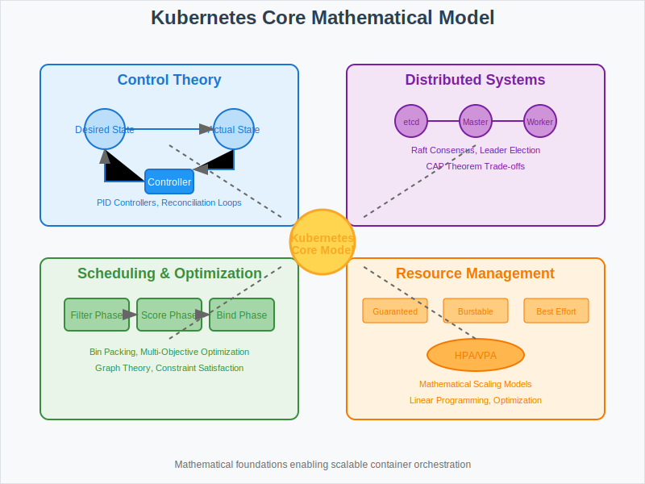

# Core Model: Kubernetes' Mathematical Foundation



## Overview

This section explores the mathematical models that underpin Kubernetes' container orchestration architecture. Understanding these core mathematical concepts is essential for designing robust, scalable distributed container systems.

## Key Mathematical Models

### 1. Control Theory Model
- **Feedback Control Systems**: Controllers continuously reconcile desired vs actual state
- **PID Controllers**: Proportional-Integral-Derivative control for auto-scaling
- **Stability Analysis**: Ensuring system convergence without oscillations

### 2. Distributed Systems Theory
- **CAP Theorem**: Consistency, Availability, and Partition tolerance trade-offs
- **Consensus Algorithms**: Raft protocol in etcd for distributed configuration
- **Leader Election**: Ensuring controller high availability and split-brain prevention

### 3. Scheduling and Resource Management
- **Bin Packing Problem**: Optimal pod placement on nodes with resource constraints
- **Multi-Objective Optimization**: Balancing resource utilization, latency, and availability
- **Graph Theory**: Modeling pod dependencies and anti-affinity constraints

### 4. Network Abstraction Model
- **Service Discovery**: DNS-based resolution and virtual IP management
- **Load Balancing**: Traffic distribution algorithms across pod endpoints
- **Network Policies**: Graph-based security models for micro-segmentation

## Mathematical Foundations

### Control Systems Theory
Kubernetes applies fundamental control theory concepts:
- **Desired State Reconciliation**: Controllers implement feedback loops
- **Convergence Properties**: Ensuring system stability under varying loads
- **Observer Pattern**: Monitoring system state through metrics and events

### Graph Theory Applications
Pod scheduling and networking through:
- **Dependency Graphs**: Modeling service relationships and startup ordering
- **Constraint Satisfaction**: Solving placement problems with multiple requirements
- **Network Topology**: Optimizing communication paths between services

### Optimization Theory
Resource management using:
- **Linear Programming**: Optimal resource allocation across nodes
- **Heuristic Algorithms**: Approximation solutions for NP-hard scheduling problems
- **Multi-Criteria Decision Making**: Balancing conflicting scheduling objectives

## Core Algorithms

### Scheduler Algorithms
1. **Filtering Phase**: Eliminate nodes that cannot satisfy pod requirements
2. **Scoring Phase**: Rank viable nodes using weighted scoring functions
3. **Binding Phase**: Assign pod to highest-scoring node atomically

### Controller Algorithms
1. **Watch-Based Reconciliation**: Event-driven state management
2. **Work Queue Processing**: Ensuring ordered processing of state changes
3. **Exponential Backoff**: Handling transient failures gracefully

### Networking Algorithms
1. **Service Endpoint Management**: Dynamic load balancer configuration
2. **DNS Resolution**: Service name to IP address mapping
3. **Network Policy Enforcement**: Rules-based traffic filtering

## Performance Models

### Throughput Analysis
Mathematical models for:
- **API Server Throughput**: Request processing capacity and bottlenecks
- **Scheduler Throughput**: Pod placement rate and queue processing
- **Controller Throughput**: Reconciliation loop performance

### Latency Models
Analysis of:
- **Pod Startup Latency**: Image pulling, scheduling, and container initialization
- **Service Discovery Latency**: DNS resolution and endpoint propagation
- **Rolling Update Latency**: Progressive deployment timing models

### Scalability Models
Understanding limits of:
- **Node Scalability**: Maximum nodes per cluster with performance guarantees
- **Pod Scalability**: Maximum pods per node based on resource constraints
- **API Object Scalability**: etcd storage and query performance limits

## Resource Management Mathematics

### Quality of Service (QoS) Classes
1. **Guaranteed**: Requests = Limits (predictable resource allocation)
2. **Burstable**: Requests < Limits (elastic resource usage)
3. **Best Effort**: No resource constraints (lowest priority)

### Horizontal Pod Autoscaler (HPA)
Mathematical model:
```
desiredReplicas = ceil[currentReplicas * (currentMetricValue / targetMetricValue)]
```

### Vertical Pod Autoscaler (VPA)
Resource recommendation algorithm:
- Historical resource usage analysis
- Percentile-based recommendation calculation
- Safety margins to prevent out-of-memory conditions

## Fault Tolerance Models

### Node Failure Handling
- **Failure Detection**: Kubelet heartbeat monitoring and timeout thresholds
- **Pod Eviction**: Grace period calculations and termination handling
- **Rescheduling Logic**: Placement decisions for evicted pods

### Network Partition Tolerance
- **Split-Brain Prevention**: Quorum-based decision making
- **Partition Detection**: Network connectivity monitoring
- **Service Continuity**: Maintaining operations during network failures

## Next Steps

- **02-math-toolkit/**: Tools and techniques for applying these mathematical models
- **03-algorithms/**: Detailed algorithm implementations and optimizations
- **04-failure-models/**: Mathematical analysis of failure scenarios and recovery
- **05-experiments/**: Hands-on validation of mathematical models