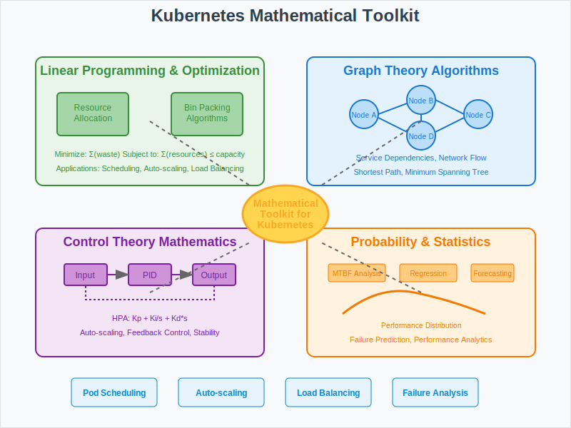

# Math Toolkit: Essential Algorithms for Kubernetes



## Overview

This section provides essential mathematical tools and techniques used in Kubernetes for solving container orchestration challenges. These tools form the foundation for implementing efficient scheduling, resource management, and distributed coordination.

## Core Mathematical Tools

### 1. Linear Programming and Optimization
**Resource Allocation Optimization**
- **Objective Function**: Minimize resource waste while maximizing performance
- **Constraints**: CPU, memory, storage, and network bandwidth limits
- **Applications**: Node selection, pod placement, cluster auto-scaling

**Simplex Method Implementation**:
```
Minimize: Σ(waste_cpu + waste_memory + waste_storage)
Subject to: 
  - Σ(pod_resources) ≤ node_capacity
  - QoS constraints
  - Anti-affinity rules
```

### 2. Graph Theory Algorithms
**Service Dependency Modeling**
- **Directed Acyclic Graphs (DAG)**: Service startup ordering
- **Shortest Path**: Optimal network routing between pods
- **Graph Coloring**: Resource conflict resolution

**Network Topology Optimization**:
- **Minimum Spanning Tree**: Efficient cluster networking
- **Network Flow**: Traffic distribution and load balancing
- **Centrality Measures**: Identifying critical service nodes

### 3. Control Theory Mathematics
**PID Controller Tuning**
- **Proportional Term**: Immediate response to current error
- **Integral Term**: Accumulated error correction
- **Derivative Term**: Predicted future error prevention

**Transfer Function Analysis**:
```
HPA(s) = Kp + Ki/s + Kd*s
Where: Kp = proportional gain
       Ki = integral gain  
       Kd = derivative gain
```

### 4. Probability and Statistics
**Failure Prediction Models**
- **Exponential Distribution**: Mean time between failures (MTBF)
- **Weibull Distribution**: Component reliability analysis
- **Markov Chains**: State transition modeling

**Performance Analytics**:
- **Statistical Process Control**: Performance threshold monitoring
- **Regression Analysis**: Resource usage forecasting
- **Time Series Analysis**: Trend detection and anomaly identification

## Scheduling Mathematics

### 1. Bin Packing Algorithms
**First Fit Decreasing (FFD)**:
```python
def schedule_pods(pods, nodes):
    # Sort pods by resource requirements (descending)
    sorted_pods = sorted(pods, key=lambda p: p.resources, reverse=True)
    assignments = {}
    
    for pod in sorted_pods:
        for node in nodes:
            if node.can_fit(pod):
                node.assign(pod)
                assignments[pod.id] = node.id
                break
    return assignments
```

**Best Fit Algorithm**:
- Find node with minimum remaining capacity that can still fit the pod
- Minimizes resource fragmentation
- Optimal for heterogeneous workloads

### 2. Multi-Objective Optimization
**Weighted Scoring Function**:
```
Score(node) = w1*cpu_utilization + w2*memory_utilization + 
              w3*network_proximity + w4*failure_domain_spread
```

**Pareto Optimization**:
- Balance between resource utilization and availability
- Trade-offs between performance and cost
- Multi-dimensional constraint satisfaction

### 3. Constraint Satisfaction Problems (CSP)
**Pod Placement Constraints**:
- Node selector constraints
- Pod affinity/anti-affinity rules
- Resource quotas and limits
- Topology spread constraints

**Backtracking Algorithm**:
```
function solve_placement(pods, constraints):
    if all_pods_placed(pods):
        return current_solution
    
    pod = select_unplaced_pod(pods)
    for node in viable_nodes(pod, constraints):
        if assign(pod, node):
            result = solve_placement(remaining_pods, constraints)
            if result is not None:
                return result
        unassign(pod, node)
    return None
```

## Resource Management Mathematics

### 1. Auto-scaling Algorithms
**Horizontal Pod Autoscaler (HPA) Formula**:
```
desired_replicas = ceil(current_replicas * current_metric / target_metric)

With stability conditions:
- Scale up: if (current_metric / target_metric) > 1.1 for 3 minutes
- Scale down: if (current_metric / target_metric) < 0.9 for 5 minutes
```

**Vertical Pod Autoscaler (VPA) Recommendation**:
```
recommended_cpu = percentile(historical_usage, 95) * safety_margin
recommended_memory = max(historical_peak, working_set_size) * safety_margin
```

### 2. Quality of Service (QoS) Mathematics
**Resource Priority Calculation**:
```
Priority Score = (requests/limits) * base_priority + qos_multiplier

Where:
- Guaranteed: qos_multiplier = 1000
- Burstable: qos_multiplier = 500  
- BestEffort: qos_multiplier = 100
```

### 3. Load Balancing Algorithms
**Weighted Round Robin**:
```
weight_ratio = pod_capacity / total_cluster_capacity
selection_probability = weight_ratio / Σ(all_weight_ratios)
```

**Least Connections Algorithm**:
```
score = active_connections / max_connections
selected_pod = min(score) across all healthy pods
```

## Networking Mathematics

### 1. Service Discovery Algorithms
**Consistent Hashing for Load Distribution**:
```
hash_value = hash(service_name + endpoint_id) % ring_size
selected_endpoint = find_closest_clockwise(hash_value, available_endpoints)
```

### 2. Network Policy Mathematics
**Traffic Matrix Calculation**:
```
Traffic_Flow[i][j] = allowed_bandwidth * policy_rules(source_i, dest_j)
```

**Network Segmentation Model**:
- Graph partitioning algorithms
- Minimum cut/maximum flow principles
- Security boundary optimization

## Performance Optimization Tools

### 1. Queuing Theory Applications
**Little's Law for Throughput Analysis**:
```
L = λ * W
Where: L = average number of requests in system
       λ = arrival rate
       W = average waiting time
```

**M/M/1 Queue Model for API Server**:
```
Average response time = 1/(μ - λ)
Where: μ = service rate, λ = arrival rate
```

### 2. Cache Optimization
**Cache Hit Ratio Optimization**:
```
hit_ratio = cache_hits / (cache_hits + cache_misses)
optimal_cache_size = argmax(hit_ratio - cache_cost)
```

### 3. Resource Utilization Metrics
**Efficiency Calculations**:
```
CPU Efficiency = (actual_cpu_usage / requested_cpu) * 100%
Memory Efficiency = (actual_memory_usage / requested_memory) * 100%
Cluster Efficiency = Σ(pod_efficiency) / total_pods
```

## Implementation Examples

### Scheduler Algorithm Implementation
```go
func (g *genericScheduler) Schedule(pod *v1.Pod, nodeLister NodeLister) (string, error) {
    // 1. Filtering phase
    filteredNodes := g.findNodesThatFit(pod, nodeLister)
    
    // 2. Scoring phase  
    priorityList, err := g.prioritizeNodes(pod, filteredNodes)
    if err != nil {
        return "", err
    }
    
    // 3. Selection phase
    return g.selectHost(priorityList)
}
```

### Auto-scaler Implementation
```go
func (a *HorizontalPodAutoscaler) calculateReplicaCount(currentReplicas int32, 
    currentMetricValue, targetMetricValue float64) int32 {
    
    utilizationRatio := currentMetricValue / targetMetricValue
    if utilizationRatio > 1.1 {
        return int32(math.Ceil(float64(currentReplicas) * utilizationRatio))
    } else if utilizationRatio < 0.9 {
        return int32(math.Floor(float64(currentReplicas) * utilizationRatio))
    }
    return currentReplicas
}
```

## Next Steps

- **03-algorithms/**: Detailed implementation of these mathematical tools
- **04-failure-models/**: Applying these tools to failure analysis and recovery
- **05-experiments/**: Practical validation of mathematical models
- **07-use-cases/**: Real-world applications of these mathematical techniques