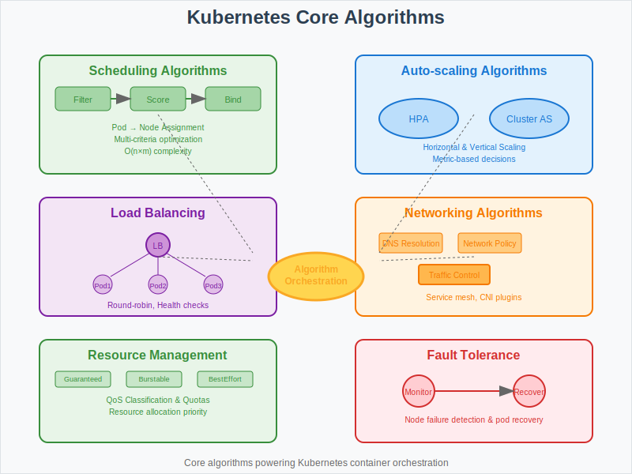

# Algorithms: Core Kubernetes Implementation Details



## Overview

This section details the core algorithms that power Kubernetes' container orchestration capabilities. These algorithms translate the mathematical models from previous sections into practical implementations for scheduling, networking, and resource management.

## Scheduling Algorithms

### 1. Pod Scheduling Algorithm
**Three-Phase Process:**
1. **Filtering Phase**: Eliminate unsuitable nodes
2. **Scoring Phase**: Rank viable nodes using weighted criteria
3. **Binding Phase**: Assign pod to optimal node

**Algorithm Implementation:**
```go
func (sched *Scheduler) Schedule(pod *v1.Pod) (string, error) {
    nodes := sched.cache.ListNodes()
    
    // Phase 1: Filter
    feasibleNodes := sched.filter(pod, nodes)
    if len(feasibleNodes) == 0 {
        return "", ErrNoNodesAvailable
    }
    
    // Phase 2: Score
    priorityList := sched.prioritize(pod, feasibleNodes)
    
    // Phase 3: Select
    selectedNode := selectHost(priorityList)
    return selectedNode, nil
}
```

### 2. Node Selection Scoring
**Multi-Criteria Scoring Function:**
- **Resource Availability**: CPU, memory, storage capacity
- **Affinity Rules**: Pod-to-pod and pod-to-node preferences
- **Anti-Affinity**: Spread pods across failure domains
- **Custom Priorities**: User-defined scheduling preferences

## Auto-Scaling Algorithms

### 1. Horizontal Pod Autoscaler (HPA)
**Core Algorithm:**
```go
func calculateDesiredReplicas(currentReplicas int32, currentValue, targetValue float64) int32 {
    utilizationRatio := currentValue / targetValue
    
    // Apply stability constraints
    if utilizationRatio > scaleUpThreshold {
        return int32(math.Ceil(float64(currentReplicas) * utilizationRatio))
    } else if utilizationRatio < scaleDownThreshold {
        return int32(math.Floor(float64(currentReplicas) * utilizationRatio))
    }
    return currentReplicas
}
```

**Key Features:**
- **Stability Windows**: Prevent thrashing during scaling decisions
- **Multiple Metrics**: Support for CPU, memory, and custom metrics
- **Scale Velocity**: Rate limiting for scaling operations

### 2. Cluster Autoscaler
**Node Management Algorithm:**
- **Scale Up Trigger**: Unscheduled pods with resource requirements
- **Scale Down Logic**: Remove underutilized nodes safely
- **Node Group Management**: Handle multiple instance types and zones

## Load Balancing Algorithms

### 1. Service Load Balancing
**Round-Robin with Health Checks:**
```go
func (lb *LoadBalancer) SelectEndpoint(endpoints []Endpoint) *Endpoint {
    healthyEndpoints := filterHealthy(endpoints)
    if len(healthyEndpoints) == 0 {
        return nil
    }
    
    // Round-robin selection
    selected := healthyEndpoints[lb.counter%len(healthyEndpoints)]
    lb.counter++
    return &selected
}
```

### 2. Session Affinity
**Consistent Hashing for Session Persistence:**
- **Hash Ring**: Map sessions to endpoints consistently
- **Failover Logic**: Redirect sessions when endpoints fail
- **Load Distribution**: Balance sessions across available endpoints

## Networking Algorithms

### 1. Service Discovery
**DNS-Based Resolution:**
- **Service Name Translation**: Convert service names to cluster IPs
- **Endpoint Updates**: Dynamic endpoint list management
- **Cache Management**: DNS caching with TTL optimization

### 2. Network Policy Enforcement
**Traffic Filtering Algorithm:**
```go
func (np *NetworkPolicy) AllowTraffic(src, dst PodInfo, port int) bool {
    // Check ingress rules
    if !np.checkIngressRules(src, dst, port) {
        return false
    }
    
    // Check egress rules
    if !np.checkEgressRules(src, dst, port) {
        return false
    }
    
    return true
}
```

## Resource Management Algorithms

### 1. Quality of Service (QoS) Classification
**Priority Assignment:**
```go
func (qos *QoSManager) ClassifyPod(pod *v1.Pod) QoSClass {
    if hasGuaranteedResources(pod) {
        return QoSGuaranteed
    } else if hasBurstableResources(pod) {
        return QoSBurstable
    }
    return QoSBestEffort
}
```

### 2. Resource Quota Enforcement
**Admission Control Algorithm:**
- **Request Validation**: Check against namespace quotas
- **Usage Tracking**: Monitor current resource consumption
- **Rejection Logic**: Deny requests exceeding quotas

## Consensus and Coordination Algorithms

### 1. Leader Election
**Raft-Based Consensus in etcd:**
- **Leader Selection**: Elect master node for each component
- **Heartbeat Protocol**: Maintain leadership through periodic messages
- **Split-Brain Prevention**: Quorum-based decision making

### 2. Controller Reconciliation
**Watch-Based Event Processing:**
```go
func (c *Controller) processWorkItem() bool {
    obj, shutdown := c.workqueue.Get()
    if shutdown {
        return false
    }
    
    defer c.workqueue.Done(obj)
    
    if err := c.reconcile(obj); err != nil {
        c.workqueue.AddRateLimited(obj)
        return true
    }
    
    c.workqueue.Forget(obj)
    return true
}
```

## Storage and Persistence Algorithms

### 1. Volume Attachment
**Dynamic Provisioning:**
- **Storage Class Selection**: Choose appropriate storage backend
- **Volume Binding**: Attach persistent volumes to pods
- **Mount Point Management**: Handle filesystem mounting

### 2. Data Replication
**StatefulSet Ordering:**
- **Sequential Startup**: Maintain predictable pod ordering
- **Persistent Identity**: Stable network identities and storage
- **Graceful Termination**: Ordered shutdown procedures

## Performance Optimization Algorithms

### 1. Resource Bin Packing
**First Fit Decreasing:**
- Sort pods by resource requirements (descending)
- Place each pod on first node with sufficient capacity
- Minimize resource fragmentation

### 2. Cache Management
**Multi-Level Caching:**
- **API Server Cache**: In-memory object caching
- **Client-Side Cache**: Reduce API server load
- **Watch Cache**: Efficient event streaming

## Fault Tolerance Algorithms

### 1. Node Failure Detection
**Heartbeat Monitoring:**
```go
func (nm *NodeManager) monitorNodeHealth(node *v1.Node) {
    ticker := time.NewTicker(healthCheckInterval)
    defer ticker.Stop()
    
    for {
        select {
        case <-ticker.C:
            if !nm.isNodeHealthy(node) {
                nm.markNodeUnhealthy(node)
                nm.evictPodsFromNode(node)
            }
        }
    }
}
```

### 2. Pod Recovery
**Restart Policy Implementation:**
- **Always**: Restart failed containers unconditionally
- **OnFailure**: Restart only on non-zero exit codes
- **Never**: No automatic restart behavior

## Implementation Patterns

### 1. Controller Pattern
**Reconciliation Loop:**
```go
for {
    desired := getDesiredState()
    current := getCurrentState()
    
    if !reflect.DeepEqual(desired, current) {
        err := reconcile(desired, current)
        if err != nil {
            logError(err)
            continue
        }
    }
    
    time.Sleep(reconciliationInterval)
}
```

### 2. Event-Driven Architecture
**Watch API Implementation:**
- **Resource Versioning**: Track object changes efficiently
- **Event Streaming**: Real-time notification of cluster state changes
- **Graceful Reconnection**: Handle connection failures transparently

## Performance Considerations

### 1. Algorithm Complexity
- **Scheduling**: O(n*m) where n=pods, m=nodes
- **Load Balancing**: O(1) for round-robin selection
- **Network Policy**: O(r) where r=rules per policy

### 2. Scalability Limits
- **API Server**: Request rate limiting and caching
- **etcd**: Watch connection limits and key space size
- **Scheduler**: Batch processing for high pod volumes

## Next Steps

- **04-failure-models/**: Analyzing failure scenarios in these algorithms
- **05-experiments/**: Testing algorithm performance and scalability
- **07-use-cases/**: Real-world implementations of these algorithms