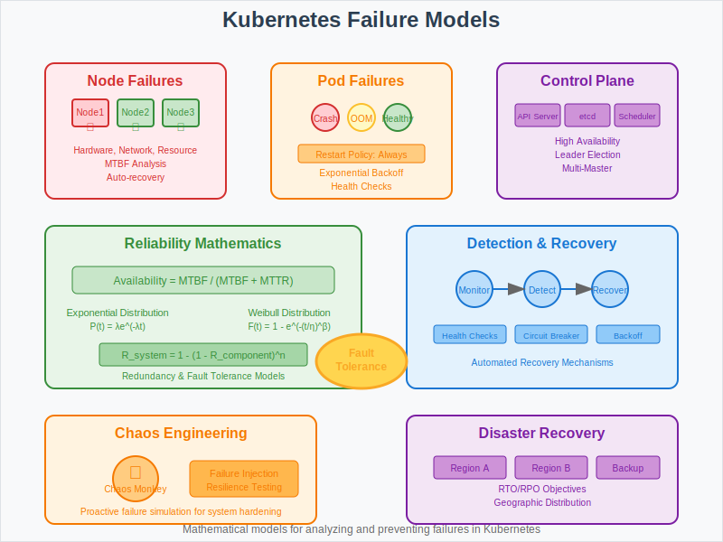

# Failure Models: Kubernetes Fault Tolerance Analysis



## Overview

This section analyzes failure scenarios in Kubernetes clusters and the mathematical models used to ensure system resilience. Understanding failure patterns is crucial for designing robust container orchestration systems.

## Common Failure Scenarios

### 1. Node Failures
**Hardware and Network Failures**
- **Node Crash**: Complete node shutdown or hardware failure
- **Network Partition**: Node becomes unreachable but continues running
- **Resource Exhaustion**: Out of memory, disk full, or CPU overload

**Detection and Recovery**:
```go
// Node failure detection using heartbeat
if time.Since(node.LastHeartbeat) > nodeFailureThreshold {
    markNodeUnhealthy(node)
    evictPodsFromNode(node)
    rescheduleEvictedPods()
}
```

### 2. Pod Failures
**Container and Application Failures**
- **Container Crash**: Application exits with non-zero code
- **Health Check Failures**: Liveness or readiness probe failures
- **Resource Limits**: OOM kills or CPU throttling

**Recovery Strategies**:
- **Restart Policy**: Always, OnFailure, Never
- **Backoff Strategy**: Exponential backoff for restart attempts
- **Circuit Breaker**: Prevent cascading failures

### 3. Control Plane Failures
**Master Component Failures**
- **API Server Outage**: Unable to process API requests
- **etcd Failure**: Loss of cluster state storage
- **Scheduler Failure**: Unable to place new pods

**High Availability Design**:
- **Multi-Master Setup**: Multiple API server replicas
- **etcd Cluster**: Distributed consensus with odd number of nodes
- **Leader Election**: Automatic failover for controllers

## Mathematical Models for Reliability

### 1. Availability Calculations
**System Availability Formula**:
```
Availability = MTBF / (MTBF + MTTR)

Where:
- MTBF = Mean Time Between Failures
- MTTR = Mean Time To Recovery
```

**Component Availability**:
- Single Node: 99.9% (8.77 hours downtime/year)
- Kubernetes Cluster: 99.99% (52.6 minutes downtime/year)
- Multi-Zone Cluster: 99.999% (5.26 minutes downtime/year)

### 2. Failure Rate Models
**Exponential Distribution for Component Failures**:
```
P(t) = λe^(-λt)

Where:
- λ = failure rate (failures per unit time)
- t = time
- P(t) = probability of failure by time t
```

**Weibull Distribution for Wear-out Failures**:
```
F(t) = 1 - e^(-(t/η)^β)

Where:
- η = scale parameter
- β = shape parameter
- β < 1: decreasing failure rate
- β = 1: constant failure rate (exponential)
- β > 1: increasing failure rate
```

### 3. Redundancy and Fault Tolerance
**N+K Redundancy Model**:
- N = minimum required instances
- K = additional redundant instances
- Total instances = N + K

**System Reliability with Redundancy**:
```
R_system = 1 - (1 - R_component)^n

Where:
- R_component = reliability of single component
- n = number of redundant components
```

## Failure Detection Mechanisms

### 1. Health Checks
**Probe Types and Timing**:
```yaml
livenessProbe:
  httpGet:
    path: /health
    port: 8080
  initialDelaySeconds: 30
  periodSeconds: 10
  timeoutSeconds: 5
  failureThreshold: 3
```

**Mathematical Analysis**:
- **Detection Time**: periodSeconds × failureThreshold
- **False Positive Rate**: Based on timeout and network latency
- **Recovery Time**: Detection time + restart time

### 2. Resource Monitoring
**Resource Exhaustion Detection**:
```go
func detectResourceExhaustion(node *Node) bool {
    if node.CPUUsage > cpuThreshold || 
       node.MemoryUsage > memoryThreshold ||
       node.DiskUsage > diskThreshold {
        return true
    }
    return false
}
```

**Predictive Failure Models**:
- **Trend Analysis**: Linear regression on resource usage
- **Anomaly Detection**: Statistical deviation from normal patterns
- **Machine Learning**: Pattern recognition for failure prediction

## Recovery Strategies

### 1. Automatic Recovery
**Pod Restart Policies**:
```go
type RestartPolicy string

const (
    RestartPolicyAlways    RestartPolicy = "Always"
    RestartPolicyOnFailure RestartPolicy = "OnFailure"
    RestartPolicyNever     RestartPolicy = "Never"
)
```

**Exponential Backoff Algorithm**:
```go
func calculateBackoffDelay(attempts int) time.Duration {
    if attempts == 0 {
        return 0
    }
    
    // Exponential backoff with jitter
    delay := time.Duration(math.Pow(2, float64(attempts-1))) * time.Second
    maxDelay := 300 * time.Second // 5 minutes max
    
    if delay > maxDelay {
        delay = maxDelay
    }
    
    // Add jitter to prevent thundering herd
    jitter := time.Duration(rand.Float64() * float64(delay) * 0.1)
    return delay + jitter
}
```

### 2. Graceful Degradation
**Circuit Breaker Pattern**:
- **Closed State**: Normal operation, track failures
- **Open State**: Fail fast, reject requests
- **Half-Open State**: Limited requests to test recovery

**Load Shedding**:
- **Priority-based**: Drop lower priority requests first
- **Rate Limiting**: Throttle incoming requests
- **Resource-based**: Reject requests when resources low

## Disaster Recovery Models

### 1. Backup and Restore
**etcd Backup Strategy**:
```bash
# Regular etcd snapshots
ETCDCTL_API=3 etcdctl snapshot save backup.db \
  --endpoints=https://127.0.0.1:2379 \
  --cacert=/etc/kubernetes/pki/etcd/ca.crt \
  --cert=/etc/kubernetes/pki/etcd/healthcheck-client.crt \
  --key=/etc/kubernetes/pki/etcd/healthcheck-client.key
```

**Recovery Time Objective (RTO) and Recovery Point Objective (RPO)**:
- **RTO**: Maximum acceptable time to restore service
- **RPO**: Maximum acceptable data loss period
- **Backup Frequency**: Based on RPO requirements

### 2. Multi-Region Deployment
**Geographic Distribution**:
- **Active-Active**: Multiple regions serving traffic
- **Active-Passive**: Standby region for disaster recovery
- **Data Replication**: Cross-region data synchronization

**Network Partition Tolerance**:
```go
// CAP Theorem considerations
func handleNetworkPartition() {
    if isPartitioned() {
        // Choose consistency or availability
        if requireConsistency {
            rejectWrites()
        } else {
            allowInconsistentReads()
        }
    }
}
```

## Chaos Engineering

### 1. Failure Injection
**Chaos Monkey Principles**:
- **Random Failure Injection**: Simulate real-world failures
- **Blast Radius Control**: Limit impact of chaos experiments
- **Observability**: Monitor system behavior during failures

**Implementation Example**:
```go
func chaosMonkey() {
    if rand.Float64() < failureRate {
        target := selectRandomPod()
        killPod(target)
        logChaosEvent("Pod killed", target)
    }
}
```

### 2. Resilience Testing
**Stress Testing Scenarios**:
- **Resource Exhaustion**: CPU, memory, disk, network
- **Dependency Failures**: Database, external service outages
- **Network Issues**: Latency, packet loss, partitions

**Metrics for Resilience**:
```go
type ResilienceMetrics struct {
    MTBF         time.Duration  // Mean Time Between Failures
    MTTR         time.Duration  // Mean Time To Recovery
    Availability float64        // Percentage uptime
    ErrorRate    float64        // Error percentage
}
```

## Performance Impact Analysis

### 1. Failure Detection Overhead
**Monitoring Cost**:
- **CPU Usage**: Health check processing
- **Network Bandwidth**: Heartbeat and probe traffic
- **Storage I/O**: Log writing and metric collection

### 2. Recovery Time Analysis
**Factors Affecting Recovery**:
- **Detection Time**: Time to identify failure
- **Decision Time**: Time to decide recovery action
- **Execution Time**: Time to implement recovery

**Total Recovery Time**:
```
Total Recovery Time = Detection Time + Decision Time + Execution Time + Verification Time
```

## Best Practices

### 1. Design for Failure
- **Assume Everything Fails**: Design with failure in mind
- **Fail Fast**: Detect and handle failures quickly
- **Graceful Degradation**: Reduce functionality rather than complete failure

### 2. Monitoring and Alerting
- **Proactive Monitoring**: Detect issues before they cause failures
- **Meaningful Alerts**: Focus on actionable alerts
- **Runbook Automation**: Automated response to common failures

## Next Steps

- **05-experiments/**: Testing failure scenarios and recovery mechanisms
- **07-use-cases/**: Real-world failure cases and their solutions