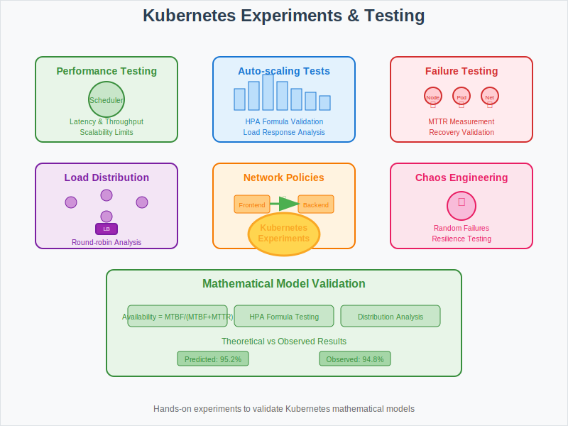

# Experiments: Hands-on Kubernetes Testing



## Overview

This section provides practical experiments to validate the mathematical models and algorithms covered in previous sections. These hands-on labs help understand Kubernetes behavior under various conditions.

## Core Experiments

### 1. Scheduler Performance Testing
**Objective**: Measure scheduling algorithm performance under load

**Experiment Setup**:
```bash
# Create test namespace
kubectl create namespace scheduler-test

# Deploy varying pod workloads
kubectl apply -f - <<EOF
apiVersion: apps/v1
kind: Deployment
metadata:
  name: scheduler-test-pods
  namespace: scheduler-test
spec:
  replicas: 100
  selector:
    matchLabels:
      app: scheduler-test
  template:
    metadata:
      labels:
        app: scheduler-test
    spec:
      containers:
      - name: test-container
        image: nginx:alpine
        resources:
          requests:
            cpu: 100m
            memory: 128Mi
EOF
```

**Metrics to Collect**:
- Scheduling latency per pod
- Node selection distribution
- Resource utilization efficiency

### 2. Auto-scaling Behavior Analysis
**Objective**: Validate HPA mathematical models

**Test Scenarios**:
```yaml
apiVersion: autoscaling/v2
kind: HorizontalPodAutoscaler
metadata:
  name: hpa-experiment
spec:
  scaleTargetRef:
    apiVersion: apps/v1
    kind: Deployment
    name: load-test-app
  minReplicas: 2
  maxReplicas: 20
  metrics:
  - type: Resource
    resource:
      name: cpu
      target:
        type: Utilization
        averageUtilization: 70
```

**Load Generation**:
```bash
# Generate CPU load
kubectl run -i --tty load-generator --rm --image=busybox --restart=Never -- \
  /bin/sh -c "while true; do wget -q -O- http://load-test-app/cpu-intensive; done"
```

### 3. Failure Recovery Testing
**Objective**: Measure MTTR and validate fault tolerance models

**Node Failure Simulation**:
```bash
# Simulate node failure
kubectl drain node-1 --ignore-daemonsets --delete-emptydir-data

# Monitor pod rescheduling time
kubectl get pods -w --field-selector spec.nodeName=node-1

# Measure recovery metrics
kubectl top pods --namespace=test-app
```

**Pod Crash Testing**:
```bash
# Deploy test application with health checks
kubectl apply -f crash-test-deployment.yaml

# Inject failures
kubectl exec deployment/crash-test -- killall -9 app-process

# Measure restart time and success rate
```

### 4. Network Policy Validation
**Objective**: Test network segmentation algorithms

**Policy Testing**:
```yaml
apiVersion: networking.k8s.io/v1
kind: NetworkPolicy
metadata:
  name: test-network-policy
spec:
  podSelector:
    matchLabels:
      app: backend
  policyTypes:
  - Ingress
  - Egress
  ingress:
  - from:
    - podSelector:
        matchLabels:
          app: frontend
    ports:
    - protocol: TCP
      port: 8080
```

**Traffic Testing**:
```bash
# Test allowed connections
kubectl exec frontend-pod -- curl backend-service:8080

# Test blocked connections
kubectl exec unauthorized-pod -- curl backend-service:8080
```

## Performance Benchmarks

### 1. Cluster Scalability Testing
**Test Configuration**:
- Node count: 10, 50, 100, 500
- Pod count: 1K, 10K, 50K, 100K
- Deployment frequency: 1/sec, 10/sec, 100/sec

**Measurements**:
```bash
# API server response times
kubectl get --raw /metrics | grep apiserver_request_duration_seconds

# Scheduler throughput
kubectl get --raw /metrics | grep scheduler_scheduling_duration_seconds

# etcd performance
kubectl get --raw /metrics | grep etcd_request_duration_seconds
```

### 2. Resource Utilization Analysis
**Bin Packing Efficiency**:
```go
func measurePackingEfficiency(nodes []Node, pods []Pod) float64 {
    totalCapacity := calculateTotalCapacity(nodes)
    usedResources := calculateUsedResources(pods)
    wastedResources := calculateFragmentation(nodes)
    
    return (usedResources / (totalCapacity - wastedResources)) * 100
}
```

**QoS Impact Testing**:
- Deploy mixed QoS workloads (Guaranteed, Burstable, BestEffort)
- Measure resource allocation fairness
- Test eviction behavior under pressure

### 3. Load Balancing Distribution
**Service Load Testing**:
```bash
# Deploy test service with multiple replicas
kubectl apply -f load-balancer-test.yaml

# Generate traffic and measure distribution
for i in {1..1000}; do
  curl -s http://test-service/health | grep "pod-id"
done | sort | uniq -c
```

**Session Affinity Validation**:
```yaml
apiVersion: v1
kind: Service
metadata:
  name: session-test-service
spec:
  sessionAffinity: ClientIP
  sessionAffinityConfig:
    clientIP:
      timeoutSeconds: 300
```

## Mathematical Model Validation

### 1. Availability Calculations
**Actual vs Theoretical Availability**:
```bash
# Collect uptime data
kubectl get events --field-selector reason=NodeNotReady

# Calculate observed MTBF and MTTR
# Compare with theoretical models
```

**Formula Validation**:
```
Observed Availability = (Total Time - Downtime) / Total Time
Theoretical Availability = MTBF / (MTBF + MTTR)

Variance = |Observed - Theoretical| / Theoretical * 100%
```

### 2. Scaling Algorithm Accuracy
**HPA Formula Testing**:
```go
func validateHPAFormula(currentReplicas int32, currentMetric, targetMetric float64) {
    predicted := calculateDesiredReplicas(currentReplicas, currentMetric, targetMetric)
    
    time.Sleep(5 * time.Minute) // Wait for scaling
    
    actualReplicas := getCurrentReplicaCount()
    accuracy := 1.0 - math.Abs(float64(predicted-actualReplicas))/float64(predicted)
    
    logAccuracy(accuracy)
}
```

### 3. Failure Rate Analysis
**Exponential Distribution Validation**:
```python
import numpy as np
from scipy import stats

# Collect failure timestamps
failures = collectFailureData()
intervals = calculateIntervals(failures)

# Test against exponential distribution
lambda_estimate = 1.0 / np.mean(intervals)
ks_stat, p_value = stats.kstest(intervals, lambda x: stats.expon.cdf(x, scale=1/lambda_estimate))

print(f"Exponential fit p-value: {p_value}")
```

## Chaos Engineering Experiments

### 1. Random Pod Termination
**Chaos Monkey Implementation**:
```yaml
apiVersion: batch/v1beta1
kind: CronJob
metadata:
  name: chaos-monkey
spec:
  schedule: "*/15 * * * *"  # Every 15 minutes
  jobTemplate:
    spec:
      template:
        spec:
          containers:
          - name: chaos
            image: quay.io/linki/chaoskube:v0.21.0
            args:
            - --interval=10s
            - --dry-run=false
            - --random
          restartPolicy: OnFailure
```

### 2. Network Partition Testing
**Simulated Network Issues**:
```bash
# Install network chaos tools
kubectl apply -f chaos-mesh-operator.yaml

# Create network partition experiment
kubectl apply -f - <<EOF
apiVersion: chaos-mesh.org/v1alpha1
kind: NetworkChaos
metadata:
  name: network-partition-test
spec:
  action: partition
  mode: fixed-percent
  value: "30"
  duration: "30s"
  selector:
    namespaces:
      - test-app
EOF
```

### 3. Resource Exhaustion Testing
**Memory Pressure Simulation**:
```bash
# Deploy memory stress test
kubectl run memory-stress --image=progrium/stress -- --vm 1 --vm-bytes 1G

# Monitor OOM behavior and recovery
kubectl get events --field-selector reason=OOMKilling
```

## Monitoring and Observability

### 1. Metrics Collection
**Key Performance Indicators**:
```yaml
# Prometheus monitoring configuration
- job_name: 'kubernetes-scheduler'
  metrics_path: /metrics
  static_configs:
  - targets: ['kube-scheduler:10251']

- job_name: 'kubernetes-controller-manager'
  metrics_path: /metrics
  static_configs:
  - targets: ['kube-controller-manager:10252']
```

### 2. Experiment Results Analysis
**Statistical Analysis**:
```python
import pandas as pd
import matplotlib.pyplot as plt

# Load experiment data
data = pd.read_csv('experiment_results.csv')

# Calculate confidence intervals
mean_latency = data['scheduling_latency'].mean()
std_latency = data['scheduling_latency'].std()
confidence_interval = stats.norm.interval(0.95, loc=mean_latency, scale=std_latency)

# Visualize results
plt.figure(figsize=(12, 6))
plt.hist(data['scheduling_latency'], bins=50, alpha=0.7)
plt.axvline(mean_latency, color='red', linestyle='--', label=f'Mean: {mean_latency:.2f}ms')
plt.xlabel('Scheduling Latency (ms)')
plt.ylabel('Frequency')
plt.legend()
plt.show()
```

## Best Practices for Experiments

### 1. Controlled Environment
- Use dedicated test clusters
- Isolate experiments from production workloads
- Maintain consistent baseline conditions

### 2. Reproducible Results
- Document all experimental parameters
- Use version-controlled configuration files
- Implement automated test execution

### 3. Safety Measures
- Implement circuit breakers for chaos experiments
- Monitor blast radius of failure injections
- Have rollback procedures ready

## Next Steps

- **07-use-cases/**: Apply experimental findings to real-world scenarios
- **01-core-model/**: Refine mathematical models based on experimental data