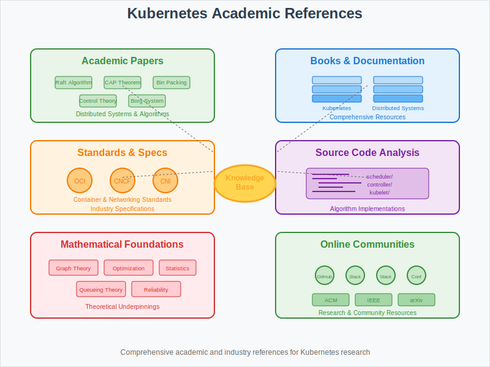

# References: Academic Papers and Resources

## Overview

This section provides key academic papers, research publications, and authoritative resources that underpin the mathematical foundations of Kubernetes and container orchestration systems.

## Core Academic Papers

### 1. Distributed Systems Theory
**Consensus and Leader Election**
- **"In Search of an Understandable Consensus Algorithm"** - Diego Ongaro, John Ousterhout (2014)
  - Foundation of Raft algorithm used in etcd
  - URL: https://raft.github.io/raft.pdf

- **"The Part-Time Parliament"** - Leslie Lamport (1998)
  - Original Paxos consensus algorithm
  - Theoretical basis for distributed coordination

**CAP Theorem and Consistency**
- **"Brewer's Conjecture and the Feasibility of Consistent, Available, Partition-Tolerant Web Services"** - Seth Gilbert, Nancy Lynch (2002)
  - Formal proof of CAP theorem
  - Critical for understanding Kubernetes design trade-offs

### 2. Resource Management and Scheduling
**Bin Packing and Optimization**
- **"A Fast and Simple Randomized Parallel Algorithm for the Maximal Independent Set Problem"** - Richard M. Karp (1985)
  - Approximation algorithms for NP-hard scheduling problems

- **"Online Algorithms for Bin Packing: A Survey"** - Coffman Jr., Csirik, Galambos, Martello, Vigo (2013)
  - Comprehensive analysis of bin packing algorithms used in pod scheduling

**Resource Allocation Theory**
- **"Dominant Resource Fairness: Fair Allocation of Multiple Resource Types"** - Ghodsi, Zaharia, Hindman, Konwinski, Shenker, Stoica (2011)
  - Multi-resource fair sharing algorithms
  - Basis for Kubernetes resource quotas and QoS

### 3. Control Theory Applications
**Feedback Control Systems**
- **"Feedback Control of Computing Systems"** - Joseph L. Hellerstein, Yixin Diao, Sujay Parekh, Dawn M. Tilbury (2004)
  - Application of control theory to computer systems
  - Foundation for Kubernetes auto-scaling algorithms

- **"Automated Control in Cloud Computing: Challenges and Opportunities"** - Abdelzaher, Diao, Hellerstein, Lu, Zhu (2008)
  - Control theory applications in distributed systems

### 4. Performance Analysis
**Queueing Theory**
- **"Introduction to Queueing Theory"** - Robert B. Cooper (1981)
  - Mathematical foundation for performance modeling
  - Applied to API server and scheduler performance analysis

- **"The Design and Implementation of a Log-Structured File System"** - Mendel Rosenblum, John K. Ousterhout (1992)
  - Log-structured storage principles used in etcd

## Kubernetes-Specific Research

### 1. Official Documentation
**Kubernetes Design Principles**
- **Kubernetes Documentation** - https://kubernetes.io/docs/
- **Kubernetes Enhancement Proposals (KEPs)** - https://github.com/kubernetes/enhancements
- **API Conventions** - https://github.com/kubernetes/community/blob/master/contributors/devel/sig-architecture/api-conventions.md

**Architectural Decisions**
- **"Kubernetes Design and Architecture"** - Kubernetes SIG Architecture
- **"Scheduler Algorithm in Kubernetes"** - Kubernetes SIG Scheduling
- **"Resource Management in Kubernetes"** - Kubernetes SIG Node

### 2. Performance and Scalability Studies
**Large Scale Deployments**
- **"Large-scale cluster management at Google with Borg"** - Abhishek Verma et al. (2015)
  - Original inspiration for Kubernetes
  - EuroSys '15 Conference

- **"Omega: flexible, scalable schedulers for large compute clusters"** - Malte Schwarzkopf et al. (2013)
  - Evolution of cluster scheduling at Google
  - Foundation for Kubernetes scheduler design

**Benchmarking Studies**
- **"An Updated Performance Comparison of Virtual Machines and Linux Containers"** - Felter, Ferreira, Rajamony, Rubio (2015)
  - Container performance characteristics

## Mathematical Foundations

### 1. Graph Theory Applications
**Network Flow and Optimization**
- **"Network Flows: Theory, Algorithms, and Applications"** - Ahuja, Magnanti, Orlin (1993)
  - Mathematical foundation for service mesh routing

- **"Introduction to Algorithms"** - Cormen, Leiserson, Rivest, Stein (2009)
  - Graph algorithms used in dependency resolution and scheduling

### 2. Probability and Statistics
**Reliability Engineering**
- **"Reliability Engineering Handbook"** - Dodson, Nolan (2002)
  - Mathematical models for system reliability
  - MTBF and MTTR calculations

- **"Introduction to Probability Models"** - Sheldon Ross (2019)
  - Stochastic processes for failure analysis

### 3. Optimization Theory
**Linear and Integer Programming**
- **"Linear Programming"** - Vasek Chvátal (1983)
  - Mathematical optimization techniques for resource allocation

- **"Integer and Combinatorial Optimization"** - Nemhauser, Wolsey (1999)
  - Advanced optimization for scheduling problems

## Industry Standards and Specifications

### 1. Container Standards
**Open Container Initiative (OCI)**
- **Runtime Specification** - https://github.com/opencontainers/runtime-spec
- **Image Format Specification** - https://github.com/opencontainers/image-spec
- **Distribution Specification** - https://github.com/opencontainers/distribution-spec

### 2. Cloud Native Computing Foundation (CNCF)
**Kubernetes Conformance**
- **Conformance Testing** - https://github.com/cncf/k8s-conformance
- **Certified Kubernetes** - https://www.cncf.io/certification/ckad/

**CNCF Projects Integration**
- **Prometheus Monitoring** - https://prometheus.io/docs/
- **Envoy Proxy** - https://www.envoyproxy.io/docs/
- **etcd Documentation** - https://etcd.io/docs/

### 3. Service Mesh and Networking
**Istio Architecture**
- **Istio Documentation** - https://istio.io/latest/docs/
- **Traffic Management** - Mathematical models for load balancing

**Container Network Interface (CNI)**
- **CNI Specification** - https://github.com/containernetworking/cni
- **Network Policy Models** - Graph theory applications

## Implementation References

### 1. Source Code Analysis
**Kubernetes Core Components**
- **kube-scheduler** - https://github.com/kubernetes/kubernetes/tree/master/pkg/scheduler
- **kube-controller-manager** - https://github.com/kubernetes/kubernetes/tree/master/pkg/controller
- **kubelet** - https://github.com/kubernetes/kubernetes/tree/master/pkg/kubelet

**Algorithm Implementations**
- **Scheduling Framework** - https://kubernetes.io/docs/concepts/scheduling-eviction/scheduling-framework/
- **Resource Management** - https://kubernetes.io/docs/concepts/configuration/manage-resources-containers/

### 2. Performance Metrics
**SIG Scalability**
- **Performance Tests** - https://github.com/kubernetes/perf-tests
- **Scalability Thresholds** - https://github.com/kubernetes/community/tree/master/sig-scalability

**Monitoring and Observability**
- **Kubernetes Metrics** - https://kubernetes.io/docs/concepts/cluster-administration/system-metrics/
- **Performance Analysis Tools** - kubectl top, metrics-server

## Books and Comprehensive Resources

### 1. Kubernetes-Focused Books
- **"Kubernetes: Up and Running"** - Kelsey Hightower, Brendan Burns, Joe Beda
- **"Programming Kubernetes"** - Michael Hausenblas, Stefan Schimanski
- **"Kubernetes Patterns"** - Bilgin Ibryam, Roland Huß

### 2. Distributed Systems Books
- **"Designing Data-Intensive Applications"** - Martin Kleppmann
- **"Distributed Systems: Principles and Paradigms"** - Andrew Tanenbaum, Maarten van Steen
- **"Building Microservices"** - Sam Newman

### 3. Mathematical and Algorithmic Resources
- **"The Algorithm Design Manual"** - Steven Skiena
- **"Probability and Statistics for Computer Science"** - David Forsyth
- **"Operations Research: An Introduction"** - Hamdy Taha

## Online Resources and Communities

### 1. Official Channels
- **Kubernetes Blog** - https://kubernetes.io/blog/
- **Kubernetes Slack** - https://slack.k8s.io/
- **Stack Overflow** - kubernetes tag

### 2. Research Communities
- **ACM Digital Library** - Container and orchestration papers
- **IEEE Xplore** - Distributed systems research
- **arXiv.org** - Latest research in distributed computing

### 3. Conferences and Events
- **KubeCon + CloudNativeCon** - Annual CNCF conference
- **USENIX OSDI** - Operating Systems Design and Implementation
- **ACM SIGCOMM** - Networking research relevant to service mesh

## Citation Format

When referencing these materials in research or documentation, use standard academic citation formats:

**Journal Articles**: Author(s). "Title." Journal Name, vol. X, no. Y, Year, pp. Z-Z.

**Conference Papers**: Author(s). "Title." Proceedings of Conference Name, Year, pp. Z-Z.

**Technical Reports**: Author(s). "Title." Institution, Report Number, Year.

**Web Resources**: "Title." Organization. URL. Accessed Date.

## Next Steps

These references provide the theoretical foundation for:
- **01-core-model/**: Mathematical models and algorithms
- **02-math-toolkit/**: Practical implementation techniques
- **03-algorithms/**: Detailed algorithmic analysis
- **05-experiments/**: Validation methodologies