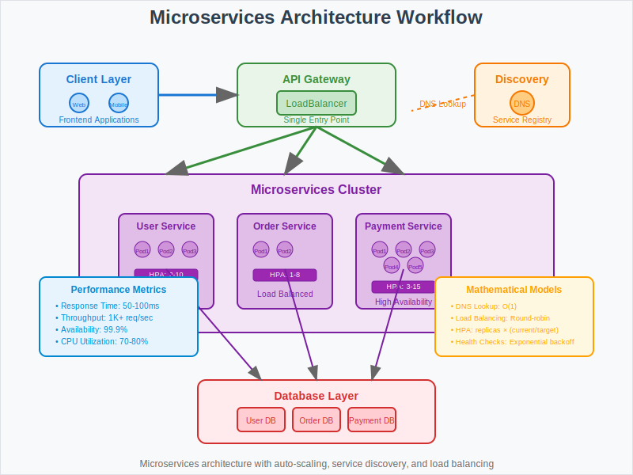

# Microservices Architecture with Kubernetes



## Overview

This use case demonstrates how to transform a monolithic application into a scalable microservices architecture using Kubernetes orchestration. It covers service discovery, load balancing, and auto-scaling patterns essential for modern distributed applications.

## Business Scenario

**Company**: TechCorp Inc.  
**Challenge**: Transform monolithic application into scalable microservices architecture using Kubernetes orchestration.

**Key Requirements**:
- Decompose monolithic application into independent services
- Implement service discovery and communication
- Enable automatic scaling based on demand
- Ensure high availability and fault tolerance

## Architecture Pattern

```
Frontend → API Gateway → [Microservices Cluster] → Database Layer
    ↓
Load Balancer → Service Mesh → Auto-scaling Pods → Persistent Storage
```

**Architecture Components**:
- **API Gateway**: Single entry point for all client requests
- **Microservices**: Independent, loosely-coupled services
- **Service Discovery**: DNS-based service location
- **Load Balancer**: Traffic distribution across service instances
- **Auto-scaler**: Dynamic resource allocation

## Kubernetes Implementation

### API Gateway Service
```yaml
apiVersion: v1
kind: Service
metadata:
  name: api-gateway
spec:
  selector:
    app: api-gateway
  ports:
  - port: 80
    targetPort: 8080
  type: LoadBalancer
```

### User Service Deployment
```yaml
apiVersion: apps/v1
kind: Deployment
metadata:
  name: user-service
spec:
  replicas: 3
  selector:
    matchLabels:
      app: user-service
  template:
    metadata:
      labels:
        app: user-service
    spec:
      containers:
      - name: user-service
        image: user-service:v1.2.0
        ports:
        - containerPort: 8080
        resources:
          requests:
            cpu: 200m
            memory: 256Mi
          limits:
            cpu: 500m
            memory: 512Mi
```

### Service Discovery Configuration
```yaml
apiVersion: v1
kind: Service
metadata:
  name: user-service
spec:
  selector:
    app: user-service
  ports:
  - port: 8080
    targetPort: 8080
  type: ClusterIP
```

### Horizontal Pod Autoscaler
```yaml
apiVersion: autoscaling/v2
kind: HorizontalPodAutoscaler
metadata:
  name: user-service-hpa
spec:
  scaleTargetRef:
    apiVersion: apps/v1
    kind: Deployment
    name: user-service
  minReplicas: 2
  maxReplicas: 10
  metrics:
  - type: Resource
    resource:
      name: cpu
      target:
        type: Utilization
        averageUtilization: 70
```

## Mathematical Foundation

### Service Discovery
- **DNS Resolution**: O(1) lookup time for service name to IP resolution
- **Service Registry**: Distributed hash table with consistent hashing

### Load Balancing
- **Round-Robin Distribution**: Even traffic distribution across healthy pods
- **Health Check Algorithm**: Periodic probe with exponential backoff on failures

### Auto-scaling
- **HPA Formula**: `desiredReplicas = ceil(currentReplicas × (currentMetric / targetMetric))`
- **Scaling Decisions**: Based on CPU/memory utilization thresholds with stability windows

## Workflow Steps

1. **Client Request**: External client sends request to API Gateway
2. **Service Discovery**: Gateway resolves target service using DNS
3. **Load Balancing**: Request routed to healthy service instance
4. **Service Processing**: Microservice processes request and may call other services
5. **Response**: Result returned through the same path
6. **Monitoring**: Metrics collected for scaling decisions

## Key Benefits

- **Scalability**: Individual services scale independently based on demand
- **Resilience**: Service failures are isolated and don't affect entire system
- **Development Velocity**: Teams can develop and deploy services independently
- **Technology Diversity**: Different services can use optimal technology stacks

## Performance Metrics

- **Response Time**: 50-100ms average for service-to-service calls
- **Throughput**: 1000+ requests/second per service instance
- **Availability**: 99.9% uptime with proper health checks and redundancy
- **Resource Utilization**: 70-80% CPU utilization with auto-scaling

## Best Practices

1. **Service Design**: Keep services focused and loosely coupled
2. **Health Checks**: Implement comprehensive liveness and readiness probes
3. **Resource Management**: Set appropriate requests and limits
4. **Monitoring**: Use distributed tracing and centralized logging
5. **Security**: Implement service mesh for encrypted communication

## Common Challenges

- **Service Communication**: Managing inter-service dependencies
- **Data Consistency**: Handling distributed transactions
- **Observability**: Tracking requests across multiple services
- **Configuration Management**: Maintaining service configurations

## Next Steps

This microservices architecture pattern provides the foundation for:
- Implementing advanced service mesh capabilities
- Adding circuit breakers and retry mechanisms  
- Integrating with CI/CD pipelines for automated deployments
- Scaling to hundreds of microservices across multiple clusters