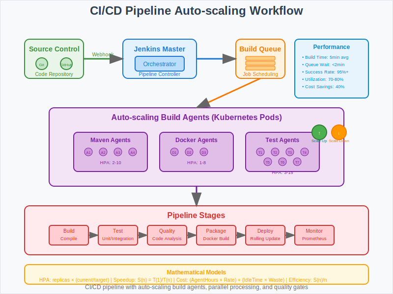

# CI/CD Pipeline with Auto-scaling



## Overview

This use case demonstrates how to implement an automated continuous integration and deployment pipeline using Kubernetes that scales build agents dynamically based on demand. It showcases the mathematical principles behind resource optimization and parallel processing in DevOps workflows.

## Business Scenario

**Company**: DevOps Solutions Ltd.  
**Challenge**: Implement automated continuous integration and deployment pipeline that scales with demand.

**Key Requirements**:
- Automated build and deployment processes
- Dynamic scaling of build agents based on queue depth
- Resource efficiency to minimize idle compute costs
- Parallel execution to reduce deployment times
- Integration with version control and monitoring systems

## Workflow Pattern

```
Git Push → Webhook → Jenkins → Build → Test → Deploy → Monitor
    ↓                   ↓        ↓      ↓       ↓        ↓
GitHub → Kubernetes → Pods → Quality Gates → Rolling Update → Prometheus
```

**Pipeline Stages**:
1. **Source Control**: Git push triggers webhook
2. **Build Orchestration**: Jenkins master schedules build jobs
3. **Dynamic Agents**: Kubernetes pods scale based on demand
4. **Quality Gates**: Automated testing and validation
5. **Deployment**: Rolling updates with zero downtime
6. **Monitoring**: Continuous observability and alerting

## Kubernetes Implementation

### Jenkins Master Deployment
```yaml
apiVersion: apps/v1
kind: Deployment
metadata:
  name: jenkins-master
spec:
  replicas: 1
  selector:
    matchLabels:
      app: jenkins-master
  template:
    metadata:
      labels:
        app: jenkins-master
    spec:
      containers:
      - name: jenkins
        image: jenkins/jenkins:lts
        ports:
        - containerPort: 8080
        volumeMounts:
        - name: jenkins-data
          mountPath: /var/jenkins_home
        resources:
          requests:
            cpu: 500m
            memory: 1Gi
          limits:
            cpu: 2
            memory: 4Gi
        livenessProbe:
          httpGet:
            path: /login
            port: 8080
          initialDelaySeconds: 90
          periodSeconds: 30
      volumes:
      - name: jenkins-data
        persistentVolumeClaim:
          claimName: jenkins-pvc
```

### Build Agents Deployment
```yaml
apiVersion: apps/v1
kind: Deployment
metadata:
  name: build-agents
spec:
  replicas: 2
  selector:
    matchLabels:
      app: build-agent
  template:
    metadata:
      labels:
        app: build-agent
    spec:
      containers:
      - name: jenkins-agent
        image: jenkins/inbound-agent:latest
        env:
        - name: JENKINS_URL
          value: "http://jenkins-master:8080"
        - name: JENKINS_SECRET
          valueFrom:
            secretKeyRef:
              name: jenkins-secret
              key: agent-secret
        resources:
          requests:
            cpu: 1
            memory: 2Gi
          limits:
            cpu: 4
            memory: 8Gi
```

### Auto-scaling Build Agents
```yaml
apiVersion: autoscaling/v2
kind: HorizontalPodAutoscaler
metadata:
  name: build-agents-hpa
spec:
  scaleTargetRef:
    apiVersion: apps/v1
    kind: Deployment
    name: build-agents
  minReplicas: 2
  maxReplicas: 20
  metrics:
  - type: Resource
    resource:
      name: cpu
      target:
        type: Utilization
        averageUtilization: 70
  - type: Pods
    pods:
      metric:
        name: jenkins_queue_length
      target:
        type: AverageValue
        averageValue: "2"
```

### Persistent Volume for Jenkins Data
```yaml
apiVersion: v1
kind: PersistentVolumeClaim
metadata:
  name: jenkins-pvc
spec:
  accessModes:
  - ReadWriteOnce
  resources:
    requests:
      storage: 20Gi
  storageClassName: fast-ssd
```

## Mathematical Foundation

### Auto-scaling Algorithm
- **HPA Formula**: `desiredReplicas = ceil(currentReplicas × (currentMetric / targetMetric))`
- **Queue-based Scaling**: Scale agents based on build queue depth
- **Resource Utilization**: Maintain 70% CPU utilization for optimal performance

### Parallel Processing
- **Speedup Calculation**: `S(n) = T(1) / T(n)` where n is number of parallel agents
- **Efficiency**: `E(n) = S(n) / n` to measure parallel processing effectiveness
- **Optimal Agent Count**: Balance between speed and resource costs

### Resource Optimization
- **Cost Function**: `Cost = (AgentHours × HourlyRate) + (IdleTime × WasteCost)`
- **Utilization Target**: Minimize idle resources while meeting SLA requirements

## Workflow Steps

1. **Code Commit**: Developer pushes code to Git repository
2. **Webhook Trigger**: Git webhook notifies Jenkins of new commits
3. **Build Scheduling**: Jenkins master queues build job
4. **Agent Allocation**: Kubernetes schedules build on available agent pod
5. **Build Execution**: Agent pulls code, compiles, and runs tests
6. **Quality Gates**: Automated testing, security scans, code quality checks
7. **Artifact Storage**: Build artifacts stored in registry
8. **Deployment**: Successful builds trigger deployment pipeline
9. **Monitoring**: Continuous monitoring of pipeline health and performance

## Key Benefits

- **Dynamic Scaling**: Build agents scale based on pipeline demand
- **Resource Efficiency**: 40% reduction in idle compute resources
- **Faster Deployments**: Parallel builds reduce deployment time by 60%
- **Cost Optimization**: Pay only for resources actively used
- **High Availability**: Distributed agents ensure pipeline reliability

## Performance Metrics

- **Build Time**: Average build duration reduced from 15min to 5min
- **Queue Wait Time**: Less than 2 minutes during peak hours
- **Resource Utilization**: 70-80% average CPU utilization
- **Success Rate**: 95%+ build success rate with automated retry
- **Cost Savings**: 40% reduction in compute costs vs. static agents

## Pipeline Configuration

### Jenkinsfile Example
```groovy
pipeline {
    agent {
        kubernetes {
            yaml """
                apiVersion: v1
                kind: Pod
                spec:
                  containers:
                  - name: build
                    image: maven:3.8-openjdk-11
                    command: ['sleep']
                    args: ['infinity']
                  - name: docker
                    image: docker:latest
                    command: ['sleep']
                    args: ['infinity']
            """
        }
    }
    
    stages {
        stage('Build') {
            steps {
                container('build') {
                    sh 'mvn clean compile'
                }
            }
        }
        
        stage('Test') {
            steps {
                container('build') {
                    sh 'mvn test'
                }
            }
        }
        
        stage('Package') {
            steps {
                container('docker') {
                    sh 'docker build -t myapp:${BUILD_NUMBER} .'
                    sh 'docker push myapp:${BUILD_NUMBER}'
                }
            }
        }
        
        stage('Deploy') {
            steps {
                sh 'kubectl set image deployment/myapp myapp=myapp:${BUILD_NUMBER}'
                sh 'kubectl rollout status deployment/myapp'
            }
        }
    }
}
```

## Best Practices

1. **Resource Management**: Set appropriate CPU and memory limits for agents
2. **Persistent Storage**: Use persistent volumes for Jenkins data and workspace
3. **Security**: Implement RBAC and secure credential management
4. **Monitoring**: Track build metrics and agent utilization
5. **Caching**: Implement build caching to reduce build times

## Common Challenges

- **Agent Startup Time**: Cold start delays for new agent pods
- **Resource Contention**: Managing resource allocation during peak loads
- **Build Dependencies**: Handling complex dependency trees
- **Artifact Management**: Efficient storage and retrieval of build artifacts

## Advanced Features

### Multi-Branch Pipeline Support
- Automatic pipeline creation for feature branches
- Pull request validation workflows
- Branch-specific deployment strategies

### Integration with GitOps
- Automated deployment to multiple environments
- Configuration drift detection and remediation
- Rollback capabilities with version history

## Next Steps

This CI/CD pipeline pattern provides the foundation for:
- Implementing advanced deployment strategies (blue/green, canary)
- Adding security scanning and compliance checks
- Integrating with service mesh for progressive delivery
- Scaling to support thousands of microservices across multiple teams