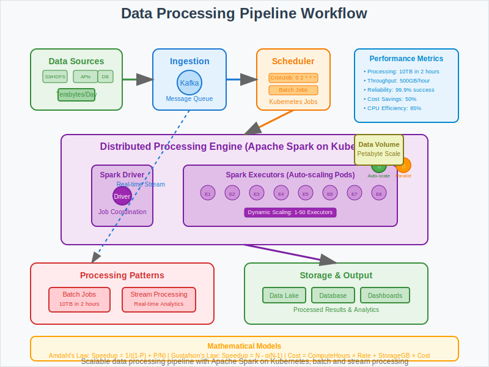

# Data Processing Pipeline with Kubernetes



## Overview

This use case demonstrates how to build scalable data processing pipelines using Kubernetes batch jobs and distributed computing frameworks like Apache Spark. It showcases mathematical principles behind parallel processing, resource optimization, and fault-tolerant data workflows.

## Business Scenario

**Company**: Analytics Pro  
**Challenge**: Process large datasets using distributed computing with Kubernetes batch jobs and real-time streaming.

**Key Requirements**:
- Process terabytes of data efficiently using distributed computing
- Schedule batch jobs for regular data processing workflows
- Ensure fault tolerance and automatic retry mechanisms
- Optimize resource utilization for cost-effective processing
- Support both batch and streaming data processing patterns

## Architecture Pattern

```
Data Sources → Ingestion → Processing → Storage → Visualization
     ↓            ↓          ↓          ↓          ↓
  S3/HDFS → Kafka/Queue → Spark Jobs → Database → Dashboard
```

**Pipeline Components**:
1. **Data Sources**: External data feeds, databases, file systems
2. **Ingestion Layer**: Kafka, message queues, data connectors
3. **Processing Engine**: Spark on Kubernetes with dynamic scaling
4. **Storage Layer**: Distributed databases, data lakes, warehouses
5. **Visualization**: Business intelligence dashboards and analytics

## Kubernetes Implementation

### Spark Driver Job
```yaml
apiVersion: batch/v1
kind: Job
metadata:
  name: data-processing-job
  labels:
    app: spark-data-processing
spec:
  template:
    metadata:
      labels:
        app: spark-driver
    spec:
      serviceAccountName: spark-service-account
      containers:
      - name: spark-driver
        image: spark:3.2.0
        command: ["/opt/spark/bin/spark-submit"]
        args:
        - "--master"
        - "k8s://https://kubernetes.default.svc:443"
        - "--deploy-mode"
        - "cluster"
        - "--class"
        - "com.analytics.DataProcessor"
        - "--conf"
        - "spark.executor.instances=10"
        - "--conf"
        - "spark.executor.memory=4g"
        - "--conf"
        - "spark.executor.cores=2"
        - "--conf"
        - "spark.kubernetes.container.image=spark:3.2.0"
        - "s3a://data-bucket/processing-job.jar"
        resources:
          requests:
            cpu: 1
            memory: 2Gi
          limits:
            cpu: 2
            memory: 4Gi
        env:
        - name: AWS_ACCESS_KEY_ID
          valueFrom:
            secretKeyRef:
              name: aws-credentials
              key: access-key-id
        - name: AWS_SECRET_ACCESS_KEY
          valueFrom:
            secretKeyRef:
              name: aws-credentials
              key: secret-access-key
      restartPolicy: Never
  backoffLimit: 3
  activeDeadlineSeconds: 3600  # 1 hour timeout
```

### Scheduled Data Pipeline
```yaml
apiVersion: batch/v1
kind: CronJob
metadata:
  name: daily-analytics
spec:
  schedule: "0 2 * * *"  # Daily at 2 AM UTC
  concurrencyPolicy: Forbid  # Prevent overlapping jobs
  successfulJobsHistoryLimit: 3
  failedJobsHistoryLimit: 1
  jobTemplate:
    spec:
      template:
        metadata:
          labels:
            app: daily-analytics
        spec:
          containers:
          - name: analytics-job
            image: analytics-processor:latest
            env:
            - name: DATA_SOURCE
              value: "s3://daily-data/"
            - name: OUTPUT_PATH
              value: "s3://processed-data/"
            - name: PROCESSING_DATE
              value: "$(date -d 'yesterday' '+%Y-%m-%d')"
            resources:
              requests:
                cpu: 2
                memory: 8Gi
              limits:
                cpu: 4
                memory: 16Gi
          restartPolicy: OnFailure
```

### Real-time Stream Processing
```yaml
apiVersion: apps/v1
kind: Deployment
metadata:
  name: kafka-streams-processor
spec:
  replicas: 3
  selector:
    matchLabels:
      app: stream-processor
  template:
    metadata:
      labels:
        app: stream-processor
    spec:
      containers:
      - name: kafka-streams
        image: kafka-streams-processor:latest
        env:
        - name: BOOTSTRAP_SERVERS
          value: "kafka-cluster:9092"
        - name: APPLICATION_ID
          value: "real-time-analytics"
        - name: INPUT_TOPIC
          value: "raw-events"
        - name: OUTPUT_TOPIC
          value: "processed-events"
        resources:
          requests:
            cpu: 1
            memory: 2Gi
          limits:
            cpu: 2
            memory: 4Gi
        livenessProbe:
          httpGet:
            path: /health
            port: 8080
          initialDelaySeconds: 60
          periodSeconds: 30
```

### Horizontal Pod Autoscaler for Stream Processing
```yaml
apiVersion: autoscaling/v2
kind: HorizontalPodAutoscaler
metadata:
  name: stream-processor-hpa
spec:
  scaleTargetRef:
    apiVersion: apps/v1
    kind: Deployment
    name: kafka-streams-processor
  minReplicas: 2
  maxReplicas: 15
  metrics:
  - type: Resource
    resource:
      name: cpu
      target:
        type: Utilization
        averageUtilization: 70
  - type: Pods
    pods:
      metric:
        name: kafka_consumer_lag
      target:
        type: AverageValue
        averageValue: "1000"
```

## Mathematical Foundation

### Parallel Processing Theory
- **Amdahl's Law**: `Speedup = 1 / ((1-P) + P/N)` where P is parallelizable portion, N is processors
- **Gustafson's Law**: `Speedup = N - α(N-1)` for scalable problems
- **Efficiency**: `E = Speedup / N` to measure resource utilization

### Data Partitioning Algorithms
- **Hash Partitioning**: Uniform data distribution using hash functions
- **Range Partitioning**: Ordered data distribution for sorted processing
- **Round-Robin**: Simple load balancing across processing nodes

### Resource Optimization
- **Cost Function**: `Cost = (ComputeHours × Rate) + (StorageGB × StorageCost)`
- **Throughput Maximization**: Balance between parallelism and coordination overhead
- **Memory Management**: Optimal memory allocation for cache efficiency

## Workflow Steps

1. **Data Ingestion**: Raw data arrives from various sources (APIs, files, streams)
2. **Job Scheduling**: Kubernetes CronJob triggers processing at scheduled intervals
3. **Resource Allocation**: Scheduler allocates pods based on job requirements
4. **Spark Job Launch**: Driver pod starts and requests executor pods
5. **Distributed Processing**: Data processed in parallel across executor pods
6. **Intermediate Results**: Shuffle operations exchange data between executors
7. **Output Generation**: Final results written to storage systems
8. **Cleanup**: Executor pods terminated after job completion
9. **Monitoring**: Job status and metrics collected for analysis

## Performance Metrics

- **Processing Speed**: 10TB data processed in 2 hours
- **Cost Optimization**: 50% reduction using spot instances and auto-scaling
- **Reliability**: 99.9% job completion rate with retry logic
- **Throughput**: 500GB/hour sustained processing rate
- **Resource Efficiency**: 85% CPU utilization during processing
- **Fault Recovery**: Average 30-second recovery from executor failures

## Data Processing Patterns

### Batch Processing
```yaml
# Large dataset processing with configurable parallelism
apiVersion: batch/v1
kind: Job
metadata:
  name: monthly-aggregation
spec:
  parallelism: 10  # Process 10 partitions concurrently
  completions: 10  # Ensure all partitions complete
  template:
    spec:
      containers:
      - name: batch-processor
        image: data-processor:latest
        env:
        - name: PARTITION_ID
          value: "$(JOB_COMPLETION_INDEX)"
        - name: TOTAL_PARTITIONS
          value: "10"
```

### Streaming Processing
```java
// Kafka Streams topology for real-time processing
StreamsBuilder builder = new StreamsBuilder();
KStream<String, Event> events = builder.stream("input-events");

// Transform and aggregate in real-time
events
    .filter((key, event) -> event.isValid())
    .groupByKey()
    .windowedBy(TimeWindows.of(Duration.ofMinutes(5)))
    .aggregate(
        () -> new EventAggregate(),
        (key, event, aggregate) -> aggregate.add(event)
    )
    .toStream()
    .to("aggregated-events");
```

## Best Practices

1. **Resource Management**: Set appropriate CPU and memory limits based on data size
2. **Data Partitioning**: Optimize partition strategy for balanced processing
3. **Fault Tolerance**: Implement checkpointing and retry mechanisms
4. **Monitoring**: Track job progress and resource utilization
5. **Cost Optimization**: Use spot instances and auto-scaling for batch jobs

## Common Challenges

- **Data Skew**: Uneven data distribution causing processing bottlenecks
- **Memory Management**: OOM errors in large dataset processing
- **Network Bottlenecks**: Shuffle operations overwhelming network capacity
- **Dependency Management**: Version conflicts in distributed environments
- **Resource Contention**: Competition for cluster resources during peak times

## Advanced Features

### Dynamic Scaling Based on Queue Depth
- Monitor input queue size and scale processing capacity
- Use custom metrics for HPA decisions
- Implement backpressure mechanisms

### Multi-Stage Processing Pipelines
- Chain multiple Kubernetes jobs for complex workflows
- Use workflow orchestrators like Argo Workflows
- Implement data lineage tracking

### Hybrid Processing (Batch + Streaming)
- Lambda architecture with both batch and stream processing
- Kappa architecture with unified stream processing
- Event sourcing patterns for data consistency

## Integration Examples

### Apache Airflow Integration
```python
from airflow import DAG
from airflow.providers.kubernetes.operators.kubernetes_pod import KubernetesPodOperator

dag = DAG('data-processing-pipeline')

spark_job = KubernetesPodOperator(
    task_id='spark-processing',
    name='spark-job',
    image='spark:3.2.0',
    cmds=['/opt/spark/bin/spark-submit'],
    arguments=['--master', 'k8s://kubernetes.default.svc:443',
               '--class', 'DataProcessor',
               's3://bucket/job.jar'],
    dag=dag
)
```

## Next Steps

This data processing pipeline pattern provides the foundation for:
- Implementing machine learning pipelines with MLflow
- Building real-time recommendation systems
- Creating data lakes with automated ETL processes
- Scaling to petabyte-scale data processing workloads