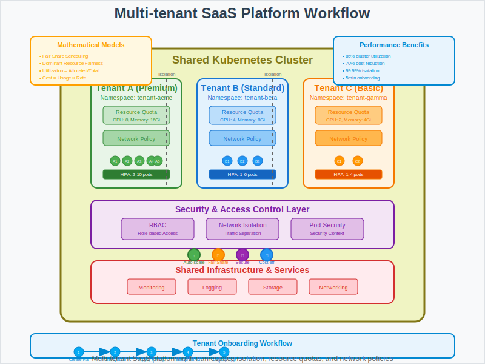

# Multi-tenant SaaS Platform with Kubernetes



## Overview

This use case demonstrates how to build a multi-tenant Software-as-a-Service (SaaS) platform using Kubernetes namespaces, resource quotas, and network policies to provide isolated, scalable environments for multiple customers on shared infrastructure. It showcases mathematical principles behind resource allocation, fair sharing, and security isolation.

## Business Scenario

**Company**: CloudSoft Inc.  
**Challenge**: Provide isolated, scalable environments for multiple customers on shared Kubernetes infrastructure.

**Key Requirements**:
- Strong tenant isolation for security and compliance
- Guaranteed resource allocation per tenant with fair sharing
- Network-level separation between tenant workloads
- Cost-effective shared infrastructure utilization
- Scalable onboarding for thousands of tenants
- Compliance with data sovereignty requirements

## Architecture Pattern

```
Tenant A → Namespace A → [Resource Quotas] → [Network Policies] → Workloads A
Tenant B → Namespace B → [Resource Quotas] → [Network Policies] → Workloads B
Tenant C → Namespace C → [Resource Quotas] → [Network Policies] → Workloads C
    ↓              ↓              ↓                    ↓              ↓
Shared Cluster → Isolation → Fair Resources → Security → Applications
```

**Multi-tenancy Components**:
1. **Namespace Isolation**: Logical separation of tenant resources
2. **Resource Quotas**: CPU, memory, and storage limits per tenant
3. **Network Policies**: Traffic isolation between tenants
4. **RBAC**: Role-based access control for tenant operations
5. **Service Mesh**: Advanced traffic management and security

## Kubernetes Implementation

### Tenant Namespace Creation
```yaml
apiVersion: v1
kind: Namespace
metadata:
  name: tenant-acme-corp
  labels:
    tenant: acme-corp
    tier: premium
    region: us-west-2
  annotations:
    contact: "admin@acme-corp.com"
    billing-id: "acme-001"
    created-date: "2025-08-26"
```

### Resource Quotas per Tenant
```yaml
apiVersion: v1
kind: ResourceQuota
metadata:
  name: tenant-acme-quota
  namespace: tenant-acme-corp
spec:
  hard:
    # Compute resources
    requests.cpu: "4"
    requests.memory: 8Gi
    limits.cpu: "8"
    limits.memory: 16Gi
    
    # Storage resources
    persistentvolumeclaims: "10"
    requests.storage: "100Gi"
    
    # Network resources
    services: "5"
    services.loadbalancers: "2"
    services.nodeports: "0"  # Disable NodePort for security
    
    # Object counts
    pods: "20"
    deployments.apps: "10"
    secrets: "15"
    configmaps: "10"
```

### Network Policy for Tenant Isolation
```yaml
apiVersion: networking.k8s.io/v1
kind: NetworkPolicy
metadata:
  name: tenant-isolation
  namespace: tenant-acme-corp
spec:
  podSelector: {}  # Apply to all pods in namespace
  policyTypes:
  - Ingress
  - Egress
  
  # Allow ingress only from same tenant namespace
  ingress:
  - from:
    - namespaceSelector:
        matchLabels:
          tenant: acme-corp
    - podSelector: {}  # Allow intra-namespace communication
  
  # Allow egress to same tenant and external services
  egress:
  - to:
    - namespaceSelector:
        matchLabels:
          tenant: acme-corp
  - to: []  # Allow external traffic
    ports:
    - protocol: TCP
      port: 53    # DNS
    - protocol: UDP
      port: 53    # DNS
    - protocol: TCP
      port: 443   # HTTPS
    - protocol: TCP
      port: 80    # HTTP
```

### Tenant Application Deployment
```yaml
apiVersion: apps/v1
kind: Deployment
metadata:
  name: tenant-application
  namespace: tenant-acme-corp
  labels:
    app: saas-app
    tenant: acme-corp
spec:
  replicas: 3
  selector:
    matchLabels:
      app: saas-app
      tenant: acme-corp
  template:
    metadata:
      labels:
        app: saas-app
        tenant: acme-corp
    spec:
      serviceAccountName: tenant-service-account
      securityContext:
        runAsNonRoot: true
        runAsUser: 1000
        fsGroup: 2000
      containers:
      - name: app
        image: saas-application:v2.1.0
        ports:
        - containerPort: 8080
        env:
        - name: TENANT_ID
          value: "acme-corp"
        - name: DATABASE_URL
          valueFrom:
            secretKeyRef:
              name: tenant-db-secret
              key: url
        resources:
          requests:
            cpu: 500m
            memory: 1Gi
          limits:
            cpu: 1
            memory: 2Gi
        livenessProbe:
          httpGet:
            path: /health
            port: 8080
          initialDelaySeconds: 30
          periodSeconds: 10
        readinessProbe:
          httpGet:
            path: /ready
            port: 8080
          initialDelaySeconds: 5
          periodSeconds: 5
```

### Horizontal Pod Autoscaler for Tenant Workloads
```yaml
apiVersion: autoscaling/v2
kind: HorizontalPodAutoscaler
metadata:
  name: tenant-app-hpa
  namespace: tenant-acme-corp
spec:
  scaleTargetRef:
    apiVersion: apps/v1
    kind: Deployment
    name: tenant-application
  minReplicas: 2
  maxReplicas: 10  # Constrained by resource quota
  metrics:
  - type: Resource
    resource:
      name: cpu
      target:
        type: Utilization
        averageUtilization: 70
  - type: Resource
    resource:
      name: memory
      target:
        type: Utilization
        averageUtilization: 80
```

### Role-Based Access Control (RBAC)
```yaml
apiVersion: rbac.authorization.k8s.io/v1
kind: Role
metadata:
  namespace: tenant-acme-corp
  name: tenant-operator
rules:
- apiGroups: [""]
  resources: ["pods", "services", "configmaps", "secrets"]
  verbs: ["get", "list", "create", "update", "patch", "delete"]
- apiGroups: ["apps"]
  resources: ["deployments", "replicasets"]
  verbs: ["get", "list", "create", "update", "patch", "delete"]

---
apiVersion: rbac.authorization.k8s.io/v1
kind: RoleBinding
metadata:
  name: tenant-operator-binding
  namespace: tenant-acme-corp
subjects:
- kind: User
  name: admin@acme-corp.com
  apiGroup: rbac.authorization.k8s.io
roleRef:
  kind: Role
  name: tenant-operator
  apiGroup: rbac.authorization.k8s.io
```

## Mathematical Foundation

### Resource Allocation Theory
- **Fair Share Scheduling**: Each tenant gets guaranteed minimum resources
- **Proportional Share**: Additional resources allocated based on tier/payment
- **Dominant Resource Fairness (DRF)**: Multi-resource fair allocation algorithm

### Capacity Planning
- **Bin Packing**: Optimal tenant placement on cluster nodes
- **Resource Utilization**: `Efficiency = Σ(AllocatedResources) / TotalClusterCapacity`
- **Overcommit Ratio**: `Overcommit = ProvisionedResources / PhysicalResources`

### Cost Optimization
- **Cost Per Tenant**: `Cost = (ResourceUsage × UnitPrice) + (StorageUsage × StoragePrice)`
- **Shared Infrastructure Savings**: `Savings = (DedicatedCost - SharedCost) / DedicatedCost × 100%`

## Workflow Steps

1. **Tenant Onboarding**: Create namespace with labels and annotations
2. **Resource Allocation**: Apply resource quotas based on tenant tier
3. **Security Setup**: Configure network policies and RBAC rules
4. **Application Deployment**: Deploy tenant-specific workloads
5. **Monitoring Setup**: Configure tenant-specific metrics and alerting
6. **Scaling Configuration**: Set up auto-scaling within resource limits
7. **Backup & Recovery**: Implement tenant data protection
8. **Compliance Validation**: Ensure regulatory compliance requirements

## Multi-tenancy Benefits

- **Resource Isolation**: Guaranteed resources per tenant with noisy neighbor protection
- **Security**: Network-level tenant separation and access controls
- **Cost Efficiency**: 70% infrastructure cost reduction vs dedicated clusters
- **Operational Efficiency**: Centralized management and updates
- **Scalability**: Support thousands of tenants on shared infrastructure

## Performance Metrics

- **Resource Utilization**: 85% average cluster utilization vs 40% with dedicated
- **Cost Savings**: 70% reduction in infrastructure costs
- **Tenant Isolation**: 99.99% isolation effectiveness with zero cross-tenant access
- **Scaling Efficiency**: Auto-scaling within 30 seconds of demand changes
- **Onboarding Speed**: New tenant deployment in under 5 minutes

## Advanced Multi-tenancy Features

### Tenant Tiers and SLA Management
```yaml
# Premium Tier Configuration
apiVersion: v1
kind: ResourceQuota
metadata:
  name: premium-tier-quota
  namespace: tenant-premium
spec:
  hard:
    requests.cpu: "16"
    requests.memory: 32Gi
    limits.cpu: "32"
    limits.memory: 64Gi

---
# Basic Tier Configuration  
apiVersion: v1
kind: ResourceQuota
metadata:
  name: basic-tier-quota
  namespace: tenant-basic
spec:
  hard:
    requests.cpu: "2"
    requests.memory: 4Gi
    limits.cpu: "4"
    limits.memory: 8Gi
```

### Dynamic Resource Allocation
```yaml
apiVersion: autoscaling/v2
kind: HorizontalPodAutoscaler
metadata:
  name: tenant-workload-hpa
spec:
  scaleTargetRef:
    apiVersion: apps/v1
    kind: Deployment
    name: tenant-workload
  minReplicas: 1
  maxReplicas: 50
  behavior:
    scaleUp:
      stabilizationWindowSeconds: 60
      policies:
      - type: Percent
        value: 100
        periodSeconds: 15
    scaleDown:
      stabilizationWindowSeconds: 300
      policies:
      - type: Percent
        value: 50
        periodSeconds: 60
```

### Service Mesh Integration for Advanced Traffic Management
```yaml
apiVersion: networking.istio.io/v1beta1
kind: VirtualService
metadata:
  name: tenant-routing
  namespace: tenant-acme-corp
spec:
  hosts:
  - acme-corp.saas-platform.com
  gateways:
  - tenant-gateway
  http:
  - match:
    - headers:
        tenant-id:
          exact: acme-corp
    route:
    - destination:
        host: tenant-application
        subset: v1
      weight: 90
    - destination:
        host: tenant-application
        subset: v2
      weight: 10  # Canary deployment
```

## Best Practices

1. **Namespace Design**: Use consistent naming conventions and labeling
2. **Resource Quotas**: Set both requests and limits to prevent resource starvation
3. **Network Policies**: Implement deny-all-by-default policies
4. **Security Context**: Run containers as non-root users
5. **Monitoring**: Implement per-tenant metrics and alerting
6. **Data Isolation**: Use encryption at rest and in transit
7. **Compliance**: Regular audits and compliance checks

## Common Challenges

- **Resource Contention**: Managing noisy neighbor effects
- **Data Sovereignty**: Ensuring tenant data stays in required regions
- **Scaling Limits**: Managing cluster capacity vs tenant growth
- **Security Boundaries**: Maintaining strict tenant isolation
- **Monitoring Complexity**: Per-tenant observability at scale

## Security Considerations

### Pod Security Standards
```yaml
apiVersion: v1
kind: Namespace
metadata:
  name: tenant-secure
  labels:
    pod-security.kubernetes.io/enforce: restricted
    pod-security.kubernetes.io/audit: restricted
    pod-security.kubernetes.io/warn: restricted
```

### Secret Management
- Use external secret management systems (HashiCorp Vault, AWS Secrets Manager)
- Implement secret rotation policies
- Encrypt secrets at rest using KMS

### Network Security
- Implement zero-trust networking principles
- Use mutual TLS for service-to-service communication
- Regular security scanning and vulnerability assessment

## Cost Management

### Resource Right-sizing
- Monitor actual resource usage vs allocated
- Implement vertical pod autoscaling for optimal sizing
- Use spot instances for non-critical workloads

### Chargeback Implementation
```yaml
# Cost allocation labels
metadata:
  labels:
    cost-center: "tenant-acme-corp"
    billing-tier: "premium"
    environment: "production"
```

## Next Steps

This multi-tenant SaaS platform pattern provides the foundation for:
- Implementing advanced tenant lifecycle management
- Adding tenant-specific feature flags and customization
- Integrating with enterprise identity providers
- Building self-service tenant portals with automated onboarding