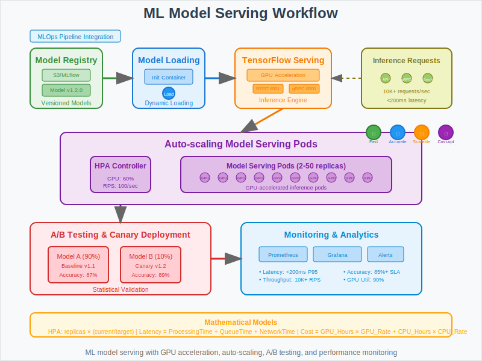

# Machine Learning Model Serving with Kubernetes



## Overview

This use case demonstrates how to deploy and scale machine learning models for real-time inference using Kubernetes with automatic model updates, A/B testing capabilities, and GPU acceleration. It showcases mathematical principles behind inference optimization, model versioning, and resource allocation for ML workloads.

## Business Scenario

**Company**: AI Innovations  
**Challenge**: Deploy and scale machine learning models for real-time inference with automatic model updates.

**Key Requirements**:
- Serve ML models at scale with low latency and high throughput
- Enable zero-downtime model updates and version management
- Support A/B testing and canary deployments for new models
- Optimize GPU resource utilization for cost efficiency
- Handle varying inference loads with automatic scaling
- Integrate with MLOps pipelines for continuous model delivery

## Architecture Pattern

```
Model Registry → Model Loading → Inference Serving → Auto-scaling → Monitoring
       ↓              ↓              ↓               ↓            ↓
   S3/MLflow → Init Container → TF Serving → HPA/VPA → Prometheus
```

**ML Serving Components**:
1. **Model Registry**: Centralized storage for trained models and metadata
2. **Model Loading**: Dynamic model loading and version management
3. **Inference Engine**: High-performance model serving (TensorFlow Serving, TorchServe)
4. **Auto-scaling**: Dynamic scaling based on inference requests and latency
5. **Monitoring**: Model performance, drift detection, and business metrics

## Kubernetes Implementation

### Model Serving Deployment
```yaml
apiVersion: apps/v1
kind: Deployment
metadata:
  name: ml-model-server
  labels:
    app: ml-model
    version: v1
spec:
  replicas: 3
  selector:
    matchLabels:
      app: ml-model
      version: v1
  template:
    metadata:
      labels:
        app: ml-model
        version: v1
    spec:
      initContainers:
      - name: model-loader
        image: model-loader:latest
        command: ["python", "/app/load_model.py"]
        env:
        - name: MODEL_NAME
          value: "recommendation_model"
        - name: MODEL_VERSION
          value: "v1.2.0"
        - name: MODEL_REGISTRY_URL
          value: "s3://ml-models/recommendation"
        volumeMounts:
        - name: model-storage
          mountPath: /models
        resources:
          requests:
            cpu: 500m
            memory: 1Gi
          limits:
            cpu: 1
            memory: 2Gi
      containers:
      - name: model-server
        image: tensorflow/serving:2.8.0-gpu
        ports:
        - containerPort: 8501  # REST API
        - containerPort: 8500  # gRPC API
        env:
        - name: MODEL_NAME
          value: "recommendation_model"
        - name: MODEL_BASE_PATH
          value: "/models"
        - name: TF_CPP_MIN_LOG_LEVEL
          value: "2"
        resources:
          requests:
            cpu: 1
            memory: 2Gi
            nvidia.com/gpu: 1
          limits:
            cpu: 4
            memory: 8Gi
            nvidia.com/gpu: 1
        readinessProbe:
          httpGet:
            path: /v1/models/recommendation_model
            port: 8501
          initialDelaySeconds: 30
          periodSeconds: 10
        livenessProbe:
          httpGet:
            path: /v1/models/recommendation_model
            port: 8501
          initialDelaySeconds: 60
          periodSeconds: 30
        volumeMounts:
        - name: model-storage
          mountPath: /models
      volumes:
      - name: model-storage
        emptyDir: {}
      nodeSelector:
        accelerator: nvidia-tesla-k80
      tolerations:
      - key: nvidia.com/gpu
        operator: Exists
        effect: NoSchedule
```

### Horizontal Pod Autoscaler with Custom Metrics
```yaml
apiVersion: autoscaling/v2
kind: HorizontalPodAutoscaler
metadata:
  name: ml-model-hpa
spec:
  scaleTargetRef:
    apiVersion: apps/v1
    kind: Deployment
    name: ml-model-server
  minReplicas: 2
  maxReplicas: 50
  metrics:
  - type: Resource
    resource:
      name: cpu
      target:
        type: Utilization
        averageUtilization: 60
  - type: Resource
    resource:
      name: memory
      target:
        type: Utilization
        averageUtilization: 70
  - type: Pods
    pods:
      metric:
        name: inference_requests_per_second
      target:
        type: AverageValue
        averageValue: "100"
  - type: Pods
    pods:
      metric:
        name: inference_latency_p95
      target:
        type: AverageValue
        averageValue: "200m"  # 200ms
  behavior:
    scaleUp:
      stabilizationWindowSeconds: 60
      policies:
      - type: Percent
        value: 100
        periodSeconds: 60
    scaleDown:
      stabilizationWindowSeconds: 300
      policies:
      - type: Percent
        value: 50
        periodSeconds: 60
```

### A/B Testing with Canary Deployment
```yaml
apiVersion: argoproj.io/v1alpha1
kind: Rollout
metadata:
  name: ml-model-rollout
spec:
  replicas: 10
  strategy:
    canary:
      steps:
      - setWeight: 10
      - pause: {duration: 5m}
      - setWeight: 30
      - pause: {duration: 10m}
      - setWeight: 50
      - pause: {duration: 15m}
      - setWeight: 100
      analysis:
        templates:
        - templateName: model-performance-analysis
        startingStep: 2
        args:
        - name: service-name
          value: ml-model-server
  selector:
    matchLabels:
      app: ml-model
  template:
    metadata:
      labels:
        app: ml-model
    spec:
      containers:
      - name: model-server
        image: tensorflow/serving:2.8.0-gpu
        ports:
        - containerPort: 8501
```

### Model Performance Analysis Template
```yaml
apiVersion: argoproj.io/v1alpha1
kind: AnalysisTemplate
metadata:
  name: model-performance-analysis
spec:
  args:
  - name: service-name
  metrics:
  - name: accuracy
    interval: 2m
    count: 5
    successCondition: result[0] >= 0.85
    provider:
      prometheus:
        address: http://prometheus.monitoring.svc.cluster.local:9090
        query: |
          model_accuracy{service="{{args.service-name}}"}
  - name: latency
    interval: 2m
    count: 5
    successCondition: result[0] <= 200
    provider:
      prometheus:
        address: http://prometheus.monitoring.svc.cluster.local:9090
        query: |
          histogram_quantile(0.95, 
            rate(inference_duration_seconds_bucket{service="{{args.service-name}}"}[2m])
          ) * 1000
```

### Model Registry Integration
```yaml
apiVersion: v1
kind: ConfigMap
metadata:
  name: mlflow-config
data:
  mlflow_tracking_uri: "http://mlflow-tracking.mlops.svc.cluster.local:5000"
  model_registry_uri: "s3://ml-model-registry"
  experiment_name: "recommendation_models"

---
apiVersion: batch/v1
kind: CronJob
metadata:
  name: model-updater
spec:
  schedule: "0 */6 * * *"  # Every 6 hours
  jobTemplate:
    spec:
      template:
        spec:
          containers:
          - name: model-updater
            image: model-updater:latest
            command: ["python", "/app/update_models.py"]
            envFrom:
            - configMapRef:
                name: mlflow-config
            volumeMounts:
            - name: model-storage
              mountPath: /models
          volumes:
          - name: model-storage
            persistentVolumeClaim:
              claimName: shared-model-storage
          restartPolicy: OnFailure
```

## Mathematical Foundation

### Inference Optimization
- **Batch Processing**: Optimize throughput with dynamic batching
- **Latency vs Throughput**: `Latency = ProcessingTime + QueueTime + NetworkTime`
- **Resource Utilization**: Balance GPU memory usage vs model size and batch size

### Auto-scaling Mathematics
- **Custom Metrics**: Scale based on inference requests per second and latency percentiles
- **Scaling Formula**: `DesiredReplicas = ceil(CurrentReplicas × (CurrentMetric / TargetMetric))`
- **Cost Optimization**: `Cost = (GPU_Hours × GPU_Rate) + (CPU_Hours × CPU_Rate)`

### Model Performance Metrics
- **Accuracy Tracking**: Monitor model drift and performance degradation
- **A/B Testing**: Statistical significance testing for model comparisons
- **Resource Efficiency**: `Throughput_per_Dollar = Requests_per_Second / Hourly_Cost`

## Workflow Steps

1. **Model Training**: Data scientists train models using ML frameworks
2. **Model Registration**: Trained models stored in MLflow registry with metadata
3. **Model Deployment**: Kubernetes deployment with init container for model loading
4. **Health Checks**: Readiness and liveness probes ensure model availability
5. **Auto-scaling**: HPA scales pods based on inference load and latency
6. **A/B Testing**: Canary deployments test new models against baseline
7. **Monitoring**: Continuous monitoring of model performance and drift
8. **Model Updates**: Automated updates based on performance thresholds

## ML Operations Benefits

- **Scalability**: Handles 10,000+ inference requests/second with sub-200ms latency
- **Model Updates**: Zero-downtime model deployments with automated rollback
- **Cost Optimization**: GPU resources scale with demand, reducing costs by 60%
- **A/B Testing**: Statistical validation of new models before full deployment
- **High Availability**: Multi-replica deployments with automatic failover

## Performance Metrics

- **Inference Latency**: P95 latency under 200ms for real-time serving
- **Throughput**: 1000+ requests/second per GPU-enabled pod
- **Model Accuracy**: Maintained above 85% threshold with drift detection
- **Resource Efficiency**: 90% GPU utilization during peak loads
- **Deployment Speed**: New model versions deployed in under 5 minutes
- **Cost Savings**: 60% reduction vs dedicated GPU instances

## Advanced ML Serving Features

### Multi-Model Serving
```yaml
apiVersion: v1
kind: ConfigMap
metadata:
  name: model-config
data:
  models.config: |
    model_config_list {
      config {
        name: 'recommendation_model'
        base_path: '/models/recommendation'
        model_platform: 'tensorflow'
        model_version_policy {
          specific {
            versions: 1
            versions: 2
          }
        }
      }
      config {
        name: 'fraud_detection_model'
        base_path: '/models/fraud_detection'
        model_platform: 'tensorflow'
      }
    }
```

### GPU Resource Management
```yaml
apiVersion: v1
kind: ResourceQuota
metadata:
  name: gpu-quota
  namespace: ml-serving
spec:
  hard:
    requests.nvidia.com/gpu: "10"
    limits.nvidia.com/gpu: "20"

---
apiVersion: scheduling.k8s.io/v1
kind: PriorityClass
metadata:
  name: ml-high-priority
value: 1000
globalDefault: false
description: "High priority for ML inference workloads"
```

### Model Monitoring and Alerting
```yaml
apiVersion: monitoring.coreos.com/v1
kind: ServiceMonitor
metadata:
  name: ml-model-metrics
spec:
  selector:
    matchLabels:
      app: ml-model
  endpoints:
  - port: metrics
    path: /metrics
    interval: 30s

---
apiVersion: monitoring.coreos.com/v1
kind: PrometheusRule
metadata:
  name: ml-model-alerts
spec:
  groups:
  - name: ml-model-serving
    rules:
    - alert: ModelLatencyHigh
      expr: histogram_quantile(0.95, rate(inference_duration_seconds_bucket[5m])) > 0.5
      for: 2m
      labels:
        severity: warning
      annotations:
        summary: "Model inference latency is high"
    - alert: ModelAccuracyLow
      expr: model_accuracy < 0.8
      for: 5m
      labels:
        severity: critical
      annotations:
        summary: "Model accuracy has dropped below threshold"
```

## Best Practices

1. **Resource Management**: Use GPU node selectors and resource quotas
2. **Model Versioning**: Implement semantic versioning for model artifacts
3. **Health Checks**: Configure appropriate readiness and liveness probes
4. **Monitoring**: Track both technical and business metrics
5. **Security**: Use secrets for model registry credentials and encryption
6. **Performance**: Optimize batch sizes and concurrent requests
7. **Cost Control**: Use spot instances for non-critical inference workloads

## Common Challenges

- **Cold Start Latency**: Model loading time affects pod startup
- **GPU Memory Management**: Balancing model size vs batch size
- **Model Drift**: Detecting performance degradation over time
- **Version Management**: Coordinating model updates across environments
- **Cost Optimization**: Balancing performance requirements with GPU costs

## Integration Examples

### MLflow Integration
```python
import mlflow
import mlflow.tensorflow

# Load model from MLflow registry
model_version = mlflow.pyfunc.load_model(
    model_uri=f"models:/recommendation_model/{model_version}"
)

# Serve model predictions
def predict(data):
    return model_version.predict(data)
```

### Kubeflow Pipelines Integration
```python
from kfp import dsl
from kfp import components

@dsl.pipeline(name='model-serving-pipeline')
def model_serving_pipeline():
    # Model training component
    train_op = components.load_component_from_file('train_model.yaml')
    
    # Model serving deployment
    serve_op = components.load_component_from_file('deploy_model.yaml')
    
    # Connect components
    serve_op.after(train_op)
```

## Next Steps

This ML model serving pattern provides the foundation for:
- Implementing federated learning across distributed clusters
- Adding explainable AI capabilities for model interpretability  
- Building real-time recommendation systems with personalization
- Scaling to support thousands of models with multi-tenancy