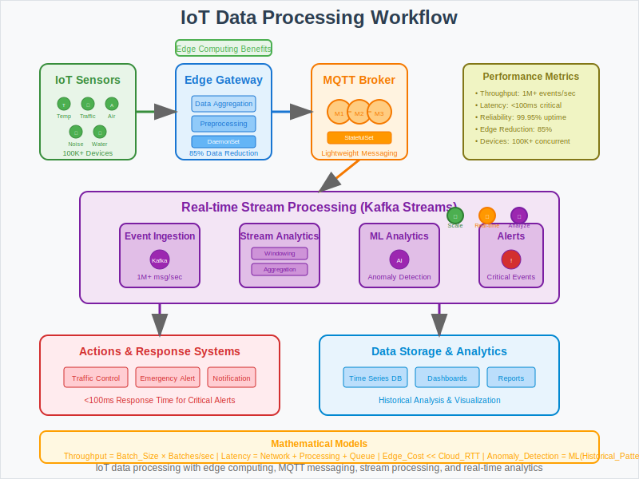

# IoT Data Processing with Kubernetes



## Overview

This use case demonstrates how to process millions of IoT sensor events in real-time using Kubernetes for traffic management, environmental monitoring, and smart city applications. It showcases mathematical principles behind stream processing, edge computing, and real-time analytics at massive scale.

## Business Scenario

**Company**: Smart City Solutions  
**Challenge**: Process millions of IoT sensor events in real-time for traffic management and environmental monitoring.

**Key Requirements**:
- Handle millions of IoT sensor readings per second
- Process data in real-time with sub-100ms latency for critical alerts
- Support heterogeneous sensor types and protocols
- Enable edge computing for reduced latency and bandwidth
- Provide real-time analytics and anomaly detection
- Ensure high availability for critical infrastructure monitoring

## Architecture Pattern

```
IoT Sensors → Edge Gateway → MQTT Broker → Stream Processing → Analytics → Actions
     ↓             ↓            ↓              ↓              ↓         ↓
  Thousands → Edge Computing → Message Queue → Kafka Streams → ML → Alerts
```

**IoT Processing Components**:
1. **IoT Sensors**: Temperature, traffic, air quality, noise sensors
2. **Edge Gateway**: Data aggregation and preprocessing at edge
3. **MQTT Broker**: Lightweight messaging for device communication
4. **Stream Processing**: Real-time event processing with Kafka Streams
5. **Analytics Engine**: Machine learning for anomaly detection
6. **Action Systems**: Automated responses and human alerts

## Kubernetes Implementation

### MQTT Message Broker StatefulSet
```yaml
apiVersion: apps/v1
kind: StatefulSet
metadata:
  name: mqtt-broker
  labels:
    app: mqtt-broker
spec:
  serviceName: mqtt-service
  replicas: 3
  selector:
    matchLabels:
      app: mqtt-broker
  template:
    metadata:
      labels:
        app: mqtt-broker
    spec:
      containers:
      - name: mosquitto
        image: eclipse-mosquitto:2.0
        ports:
        - containerPort: 1883  # MQTT
        - containerPort: 9001  # WebSocket
        - containerPort: 8883  # MQTT over TLS
        env:
        - name: MOSQUITTO_USERNAME
          valueFrom:
            secretKeyRef:
              name: mqtt-credentials
              key: username
        - name: MOSQUITTO_PASSWORD
          valueFrom:
            secretKeyRef:
              name: mqtt-credentials
              key: password
        resources:
          requests:
            cpu: 500m
            memory: 1Gi
          limits:
            cpu: 2
            memory: 4Gi
        livenessProbe:
          tcpSocket:
            port: 1883
          initialDelaySeconds: 30
          periodSeconds: 10
        readinessProbe:
          tcpSocket:
            port: 1883
          initialDelaySeconds: 5
          periodSeconds: 5
        volumeMounts:
        - name: mqtt-data
          mountPath: /mosquitto/data
        - name: mqtt-config
          mountPath: /mosquitto/config
      volumes:
      - name: mqtt-config
        configMap:
          name: mosquitto-config
  volumeClaimTemplates:
  - metadata:
      name: mqtt-data
    spec:
      accessModes: ["ReadWriteOnce"]
      resources:
        requests:
          storage: 10Gi
      storageClassName: fast-ssd
```

### IoT Stream Processing Deployment
```yaml
apiVersion: apps/v1
kind: Deployment
metadata:
  name: iot-stream-processor
  labels:
    app: stream-processor
spec:
  replicas: 5
  selector:
    matchLabels:
      app: stream-processor
  template:
    metadata:
      labels:
        app: stream-processor
    spec:
      containers:
      - name: kafka-streams
        image: iot-stream-processor:latest
        env:
        - name: KAFKA_BROKERS
          value: "kafka-service:9092"
        - name: APPLICATION_ID
          value: "iot-stream-processor"
        - name: PROCESSING_THREADS
          value: "4"
        - name: STATE_STORE_DIR
          value: "/tmp/kafka-streams"
        - name: SENSOR_TOPIC_PATTERN
          value: "sensors-.*"
        - name: OUTPUT_TOPIC
          value: "processed-iot-data"
        - name: ALERT_TOPIC
          value: "critical-alerts"
        resources:
          requests:
            cpu: 1
            memory: 2Gi
          limits:
            cpu: 4
            memory: 8Gi
        livenessProbe:
          httpGet:
            path: /health
            port: 8080
          initialDelaySeconds: 60
          periodSeconds: 30
        readinessProbe:
          httpGet:
            path: /ready
            port: 8080
          initialDelaySeconds: 30
          periodSeconds: 10
        volumeMounts:
        - name: stream-state
          mountPath: /tmp/kafka-streams
      volumes:
      - name: stream-state
        emptyDir: {}
```

### Edge Computing Gateway
```yaml
apiVersion: apps/v1
kind: DaemonSet
metadata:
  name: iot-edge-gateway
spec:
  selector:
    matchLabels:
      app: edge-gateway
  template:
    metadata:
      labels:
        app: edge-gateway
    spec:
      hostNetwork: true
      containers:
      - name: edge-gateway
        image: iot-edge-gateway:latest
        ports:
        - containerPort: 8080
          hostPort: 8080
        env:
        - name: MQTT_BROKER_URL
          value: "mqtt://mqtt-service:1883"
        - name: EDGE_NODE_ID
          valueFrom:
            fieldRef:
              fieldPath: spec.nodeName
        - name: PROCESSING_BUFFER_SIZE
          value: "1000"
        - name: BATCH_INTERVAL_MS
          value: "100"
        resources:
          requests:
            cpu: 200m
            memory: 512Mi
          limits:
            cpu: 1
            memory: 2Gi
        securityContext:
          privileged: true  # Access to host network interfaces
        volumeMounts:
        - name: device-config
          mountPath: /etc/edge-config
      volumes:
      - name: device-config
        configMap:
          name: edge-device-config
      tolerations:
      - operator: Exists  # Run on all nodes including master
```

### Real-time Analytics Engine
```yaml
apiVersion: apps/v1
kind: Deployment
metadata:
  name: iot-analytics-engine
spec:
  replicas: 3
  selector:
    matchLabels:
      app: analytics-engine
  template:
    metadata:
      labels:
        app: analytics-engine
    spec:
      containers:
      - name: analytics
        image: iot-analytics:latest
        env:
        - name: KAFKA_INPUT_TOPIC
          value: "processed-iot-data"
        - name: KAFKA_OUTPUT_TOPIC
          value: "analytics-results"
        - name: ML_MODEL_PATH
          value: "/models/anomaly-detection"
        - name: ALERT_THRESHOLD
          value: "0.95"
        resources:
          requests:
            cpu: 1
            memory: 2Gi
          limits:
            cpu: 2
            memory: 4Gi
        volumeMounts:
        - name: ml-models
          mountPath: /models
      volumes:
      - name: ml-models
        persistentVolumeClaim:
          claimName: ml-models-pvc
```

### Horizontal Pod Autoscaler for Stream Processing
```yaml
apiVersion: autoscaling/v2
kind: HorizontalPodAutoscaler
metadata:
  name: iot-stream-hpa
spec:
  scaleTargetRef:
    apiVersion: apps/v1
    kind: Deployment
    name: iot-stream-processor
  minReplicas: 3
  maxReplicas: 20
  metrics:
  - type: Resource
    resource:
      name: cpu
      target:
        type: Utilization
        averageUtilization: 70
  - type: Pods
    pods:
      metric:
        name: kafka_consumer_lag
      target:
        type: AverageValue
        averageValue: "1000"
  - type: Pods
    pods:
      metric:
        name: iot_messages_per_second
      target:
        type: AverageValue
        averageValue: "50000"
```

## Mathematical Foundation

### Stream Processing Mathematics
- **Throughput Calculation**: `Messages/Second = Batch_Size × Batches_per_Second`
- **Latency Analysis**: `End_to_End_Latency = Network_Latency + Processing_Latency + Queue_Wait_Time`
- **Backpressure Management**: Control flow to prevent system overload

### Edge Computing Optimization
- **Data Reduction**: Filter and aggregate at edge to reduce bandwidth by 80-90%
- **Latency Minimization**: `Edge_Processing_Time << Cloud_Round_Trip_Time`
- **Bandwidth Optimization**: `Cost = Data_Volume × Transfer_Rate + Processing_Cost`

### Anomaly Detection Algorithms
- **Statistical Methods**: Z-score, moving averages for threshold-based alerts
- **Machine Learning**: Isolation forests, autoencoders for complex patterns
- **Time Series Analysis**: Seasonal decomposition, trend analysis

## Workflow Steps

1. **Data Collection**: IoT sensors collect environmental and operational data
2. **Edge Processing**: Edge gateways aggregate and preprocess sensor data
3. **Message Publishing**: Processed data published to MQTT broker topics
4. **Stream Ingestion**: Kafka consumers ingest messages from MQTT bridge
5. **Real-time Processing**: Kafka Streams processes events with windowing operations
6. **Analytics**: Machine learning models analyze patterns and detect anomalies
7. **Alert Generation**: Critical events trigger immediate alerts and actions
8. **Data Storage**: Processed data stored in time-series databases
9. **Visualization**: Real-time dashboards display system status and metrics

## IoT Processing Metrics

- **Throughput**: 1M+ sensor readings/second processed across all sensors
- **Latency**: Sub-100ms processing time for critical traffic management alerts
- **Reliability**: 99.95% uptime for traffic management and emergency systems
- **Data Reduction**: 85% reduction in cloud bandwidth through edge processing
- **Accuracy**: 95%+ anomaly detection accuracy with <1% false positives
- **Scalability**: Support for 100,000+ concurrent IoT devices

## IoT Sensor Types and Use Cases

### Traffic Management System
```yaml
# Traffic sensors configuration
sensors:
  traffic_flow:
    - location: "intersection_main_elm"
      frequency: "1Hz"
      metrics: ["vehicle_count", "speed", "lane_occupancy"]
    - location: "highway_101_mile_marker_15"
      frequency: "10Hz"
      metrics: ["traffic_density", "average_speed"]
  
  traffic_lights:
    - location: "downtown_grid"
      frequency: "0.1Hz"
      metrics: ["phase_timing", "queue_length", "pedestrian_wait"]
```

### Environmental Monitoring
```yaml
# Environmental sensors
sensors:
  air_quality:
    - location: "city_center"
      frequency: "0.017Hz"  # Every minute
      metrics: ["pm2.5", "pm10", "no2", "o3", "co"]
    
  weather:
    - location: "weather_stations"
      frequency: "0.1Hz"   # Every 10 seconds
      metrics: ["temperature", "humidity", "pressure", "wind"]
    
  noise_level:
    - location: "residential_areas"
      frequency: "1Hz"
      metrics: ["decibel_level", "frequency_spectrum"]
```

### Smart Building Systems
```yaml
# Building automation sensors
sensors:
  hvac:
    - location: "office_floors"
      frequency: "0.1Hz"
      metrics: ["temperature", "co2", "occupancy", "energy_usage"]
    
  security:
    - location: "entry_points"
      frequency: "30Hz"
      metrics: ["motion", "access_events", "camera_analytics"]
```

## Stream Processing Patterns

### Windowed Aggregations
```java
// Traffic flow analysis with time windows
KStream<String, TrafficEvent> trafficStream = builder.stream("traffic-sensors");

// 5-minute tumbling windows for traffic analysis
trafficStream
    .groupByKey()
    .windowedBy(TimeWindows.of(Duration.ofMinutes(5)))
    .aggregate(
        () -> new TrafficAggregator(),
        (key, event, aggregate) -> aggregate.add(event)
    )
    .toStream()
    .to("traffic-analysis");

// Real-time anomaly detection with sliding windows
trafficStream
    .groupByKey()
    .windowedBy(SlidingWindows.ofTimeDifferenceWithNoGrace(Duration.ofMinutes(1)))
    .aggregate(
        () -> new AnomalyDetector(),
        (key, event, detector) -> detector.analyze(event)
    )
    .toStream()
    .filter((key, result) -> result.isAnomalous())
    .to("traffic-alerts");
```

### Event Correlation
```java
// Correlate traffic and weather events
KStream<String, TrafficEvent> traffic = builder.stream("traffic-sensors");
KStream<String, WeatherEvent> weather = builder.stream("weather-sensors");

// Join traffic and weather data within 10-minute window
traffic.join(weather,
    (trafficEvent, weatherEvent) -> new CorrelatedEvent(trafficEvent, weatherEvent),
    JoinWindows.of(Duration.ofMinutes(10))
)
.filter((key, correlatedEvent) -> correlatedEvent.requiresAction())
.to("traffic-weather-alerts");
```

## Best Practices

1. **Edge Computing**: Process data close to sensors to reduce latency and bandwidth
2. **Message Partitioning**: Partition MQTT topics by sensor location or type
3. **Resource Management**: Use resource quotas and limits for IoT workloads
4. **Security**: Implement TLS/SSL for MQTT communication and device authentication
5. **Data Retention**: Configure appropriate retention policies for sensor data
6. **Monitoring**: Track message throughput, processing latency, and device connectivity
7. **Fault Tolerance**: Design for sensor failures and network partitions

## Common Challenges

- **Device Heterogeneity**: Managing different sensor types and protocols
- **Network Reliability**: Handling intermittent connectivity in IoT environments  
- **Data Volume**: Processing massive amounts of sensor data efficiently
- **Edge Resource Constraints**: Limited compute power at edge locations
- **Security**: Protecting against IoT device vulnerabilities and attacks
- **Data Quality**: Handling sensor calibration and data validation

## Advanced Features

### Edge AI Processing
```yaml
apiVersion: apps/v1
kind: Deployment
metadata:
  name: edge-ai-processor
spec:
  replicas: 1
  template:
    spec:
      containers:
      - name: edge-ai
        image: tensorflow/serving:latest-gpu
        env:
        - name: MODEL_NAME
          value: "traffic-prediction"
        - name: MODEL_BASE_PATH
          value: "/models"
        resources:
          requests:
            nvidia.com/gpu: 1
          limits:
            nvidia.com/gpu: 1
        volumeMounts:
        - name: ai-models
          mountPath: /models
```

### Time Series Database Integration
```yaml
apiVersion: apps/v1
kind: StatefulSet
metadata:
  name: influxdb
spec:
  serviceName: influxdb
  replicas: 1
  template:
    spec:
      containers:
      - name: influxdb
        image: influxdb:2.0
        ports:
        - containerPort: 8086
        env:
        - name: INFLUXDB_DB
          value: "iot_sensors"
        - name: INFLUXDB_RETENTION_POLICY
          value: "30d"
        volumeMounts:
        - name: influx-data
          mountPath: /var/lib/influxdb
  volumeClaimTemplates:
  - metadata:
      name: influx-data
    spec:
      accessModes: ["ReadWriteOnce"]
      resources:
        requests:
          storage: 100Gi
```

### Real-time Dashboard
```yaml
apiVersion: apps/v1
kind: Deployment
metadata:
  name: grafana-iot
spec:
  replicas: 1
  template:
    spec:
      containers:
      - name: grafana
        image: grafana/grafana:latest
        ports:
        - containerPort: 3000
        env:
        - name: GF_SECURITY_ADMIN_PASSWORD
          valueFrom:
            secretKeyRef:
              name: grafana-credentials
              key: admin-password
        volumeMounts:
        - name: grafana-storage
          mountPath: /var/lib/grafana
        - name: dashboard-config
          mountPath: /etc/grafana/provisioning
```

## Integration Examples

### AWS IoT Core Integration
```yaml
apiVersion: v1
kind: ConfigMap
metadata:
  name: iot-bridge-config
data:
  config.yaml: |
    aws:
      region: us-west-2
      iot_endpoint: "your-iot-endpoint.iot.us-west-2.amazonaws.com"
    mqtt:
      broker: "mqtt-service:1883"
      topics:
        - "sensors/+/temperature"
        - "sensors/+/humidity"
        - "alerts/critical"
```

### Apache NiFi Integration
```yaml
apiVersion: apps/v1
kind: Deployment
metadata:
  name: nifi-iot
spec:
  replicas: 1
  template:
    spec:
      containers:
      - name: nifi
        image: apache/nifi:latest
        ports:
        - containerPort: 8080
        env:
        - name: NIFI_WEB_HTTP_PORT
          value: "8080"
        volumeMounts:
        - name: nifi-data
          mountPath: /opt/nifi/nifi-current/conf
```

## Next Steps

This IoT data processing pattern provides the foundation for:
- Implementing predictive maintenance for smart city infrastructure
- Building comprehensive environmental monitoring networks
- Creating intelligent transportation systems with ML-driven optimization
- Developing edge-to-cloud hybrid architectures for reduced latency