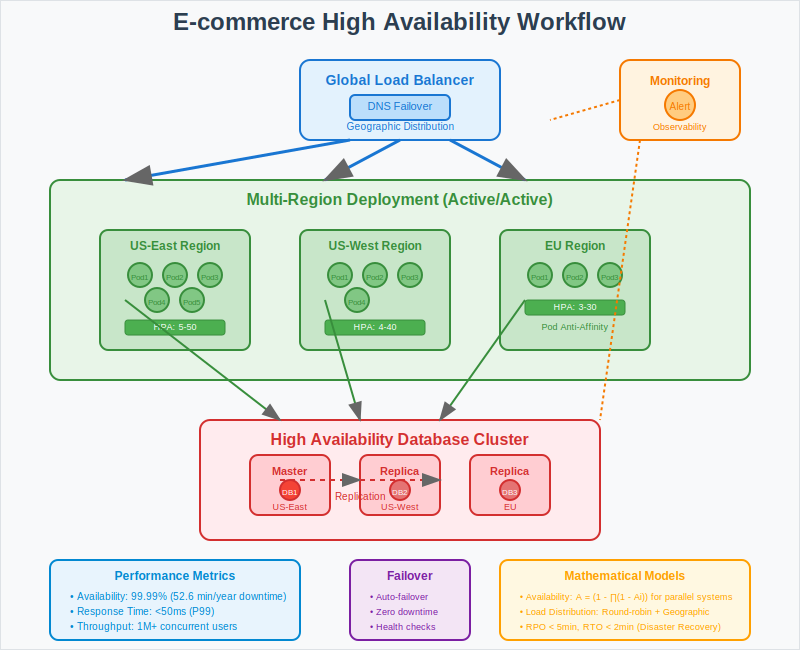

# E-commerce Platform with High Availability



## Overview

This use case demonstrates how to build a highly available e-commerce platform using Kubernetes that can support millions of customers during peak shopping seasons with zero downtime, fast response times, and automatic disaster recovery. It showcases mathematical principles behind availability calculations, load distribution, and fault tolerance design.

## Business Scenario

**Company**: Global Retail Corp  
**Challenge**: Support millions of customers during peak shopping seasons with zero downtime and fast response times.

**Key Requirements**:
- Handle millions of concurrent users during Black Friday and holiday sales
- Achieve 99.99% availability with sub-50ms response times
- Support automatic failover across multiple regions and availability zones
- Implement zero-downtime deployments and database migrations
- Ensure data consistency across distributed systems
- Provide disaster recovery with minimal data loss (RPO < 5 minutes)

## Architecture Pattern

```
Global Load Balancer → Multi-Region Deployment → Auto-scaling Pods → HA Database
        ↓                    ↓                      ↓              ↓
   DNS Failover → Active/Active Regions → Pod Anti-affinity → StatefulSets
```

**High Availability Components**:
1. **Global Load Balancer**: Geographic traffic distribution with health checks
2. **Multi-Region Deployment**: Active-active setup across multiple regions
3. **Pod Anti-Affinity**: Spread workloads across failure domains
4. **Database Replication**: Multi-master database cluster with automatic failover
5. **Auto-scaling**: Dynamic scaling based on traffic patterns and SLAs
6. **Monitoring & Alerting**: Comprehensive observability for proactive issue detection

## Kubernetes Implementation

### Multi-Region Application Deployment
```yaml
apiVersion: apps/v1
kind: Deployment
metadata:
  name: ecommerce-app
  labels:
    app: ecommerce
    tier: web
spec:
  replicas: 20
  selector:
    matchLabels:
      app: ecommerce
      tier: web
  template:
    metadata:
      labels:
        app: ecommerce
        tier: web
    spec:
      # Pod anti-affinity to spread across nodes and zones
      affinity:
        podAntiAffinity:
          preferredDuringSchedulingIgnoredDuringExecution:
          - weight: 100
            podAffinityTerm:
              labelSelector:
                matchExpressions:
                - key: app
                  operator: In
                  values:
                  - ecommerce
              topologyKey: kubernetes.io/hostname
          - weight: 50
            podAffinityTerm:
              labelSelector:
                matchExpressions:
                - key: app
                  operator: In
                  values:
                  - ecommerce
              topologyKey: topology.kubernetes.io/zone
      containers:
      - name: web-app
        image: ecommerce-app:v2.1.0
        ports:
        - containerPort: 8080
        - containerPort: 8443  # HTTPS
        env:
        - name: DATABASE_URL
          valueFrom:
            secretKeyRef:
              name: db-credentials
              key: url
        - name: REDIS_URL
          valueFrom:
            configMapKeyRef:
              name: cache-config
              key: redis-url
        - name: APP_ENV
          value: "production"
        - name: REGION
          valueFrom:
            fieldRef:
              fieldPath: metadata.annotations['topology.kubernetes.io/region']
        resources:
          requests:
            cpu: 500m
            memory: 1Gi
          limits:
            cpu: 2
            memory: 4Gi
        livenessProbe:
          httpGet:
            path: /health
            port: 8080
          initialDelaySeconds: 30
          periodSeconds: 10
          timeoutSeconds: 5
          failureThreshold: 3
        readinessProbe:
          httpGet:
            path: /ready
            port: 8080
          initialDelaySeconds: 5
          periodSeconds: 5
          timeoutSeconds: 3
          failureThreshold: 2
        startupProbe:
          httpGet:
            path: /startup
            port: 8080
          initialDelaySeconds: 10
          periodSeconds: 5
          timeoutSeconds: 3
          failureThreshold: 30
      # Graceful shutdown handling
      terminationGracePeriodSeconds: 60
      # Security context
      securityContext:
        runAsNonRoot: true
        runAsUser: 1000
        fsGroup: 2000
```

### High Availability Database Cluster
```yaml
apiVersion: apps/v1
kind: StatefulSet
metadata:
  name: postgres-ha
  labels:
    app: postgres
    tier: database
spec:
  serviceName: postgres-service
  replicas: 3
  selector:
    matchLabels:
      app: postgres
      tier: database
  template:
    metadata:
      labels:
        app: postgres
        tier: database
    spec:
      # Anti-affinity for database pods
      affinity:
        podAntiAffinity:
          requiredDuringSchedulingIgnoredDuringExecution:
          - labelSelector:
              matchExpressions:
              - key: app
                operator: In
                values:
                - postgres
            topologyKey: kubernetes.io/hostname
      containers:
      - name: postgres
        image: postgres:13-alpine
        ports:
        - containerPort: 5432
        env:
        - name: POSTGRES_DB
          value: ecommerce
        - name: POSTGRES_USER
          valueFrom:
            secretKeyRef:
              name: postgres-credentials
              key: username
        - name: POSTGRES_PASSWORD
          valueFrom:
            secretKeyRef:
              name: postgres-credentials
              key: password
        - name: POSTGRES_REPLICATION_MODE
          value: master
        - name: POSTGRES_REPLICATION_USER
          valueFrom:
            secretKeyRef:
              name: postgres-credentials
              key: replication-username
        - name: POSTGRES_REPLICATION_PASSWORD
          valueFrom:
            secretKeyRef:
              name: postgres-credentials
              key: replication-password
        resources:
          requests:
            cpu: 1
            memory: 2Gi
          limits:
            cpu: 4
            memory: 8Gi
        livenessProbe:
          exec:
            command:
            - /bin/sh
            - -c
            - exec pg_isready -U "$POSTGRES_USER" -d "$POSTGRES_DB" -h 127.0.0.1 -p 5432
          initialDelaySeconds: 30
          periodSeconds: 10
          timeoutSeconds: 5
          failureThreshold: 6
        readinessProbe:
          exec:
            command:
            - /bin/sh
            - -c
            - -e
            - exec pg_isready -U "$POSTGRES_USER" -d "$POSTGRES_DB" -h 127.0.0.1 -p 5432
          initialDelaySeconds: 5
          periodSeconds: 5
          timeoutSeconds: 1
          successThreshold: 1
          failureThreshold: 3
        volumeMounts:
        - name: postgres-data
          mountPath: /var/lib/postgresql/data
        - name: postgres-config
          mountPath: /etc/postgresql
      volumes:
      - name: postgres-config
        configMap:
          name: postgres-config
  volumeClaimTemplates:
  - metadata:
      name: postgres-data
    spec:
      accessModes: ["ReadWriteOnce"]
      storageClassName: fast-ssd
      resources:
        requests:
          storage: 100Gi
```

### Horizontal Pod Autoscaler with Advanced Scaling
```yaml
apiVersion: autoscaling/v2
kind: HorizontalPodAutoscaler
metadata:
  name: ecommerce-hpa
spec:
  scaleTargetRef:
    apiVersion: apps/v1
    kind: Deployment
    name: ecommerce-app
  minReplicas: 10
  maxReplicas: 100
  metrics:
  - type: Resource
    resource:
      name: cpu
      target:
        type: Utilization
        averageUtilization: 70
  - type: Resource
    resource:
      name: memory
      target:
        type: Utilization
        averageUtilization: 80
  - type: Pods
    pods:
      metric:
        name: http_requests_per_second
      target:
        type: AverageValue
        averageValue: "1000"
  - type: Pods
    pods:
      metric:
        name: response_time_p95
      target:
        type: AverageValue
        averageValue: "50m"  # 50ms
  behavior:
    scaleUp:
      stabilizationWindowSeconds: 60
      policies:
      - type: Percent
        value: 50
        periodSeconds: 60
      - type: Pods
        value: 10
        periodSeconds: 60
      selectPolicy: Max
    scaleDown:
      stabilizationWindowSeconds: 300
      policies:
      - type: Percent
        value: 25
        periodSeconds: 60
      selectPolicy: Min
```

### Pod Disruption Budget
```yaml
apiVersion: policy/v1
kind: PodDisruptionBudget
metadata:
  name: ecommerce-pdb
spec:
  minAvailable: 80%
  selector:
    matchLabels:
      app: ecommerce
      tier: web
---
apiVersion: policy/v1
kind: PodDisruptionBudget
metadata:
  name: postgres-pdb
spec:
  minAvailable: 2
  selector:
    matchLabels:
      app: postgres
      tier: database
```

### Global Load Balancer Service
```yaml
apiVersion: v1
kind: Service
metadata:
  name: ecommerce-global-lb
  annotations:
    cloud.google.com/global-access: "true"
    cloud.google.com/backend-config: '{"default": "ecommerce-backend-config"}'
    cloud.google.com/neg: '{"ingress": true}'
spec:
  type: LoadBalancer
  loadBalancerSourceRanges:
  - 0.0.0.0/0
  ports:
  - name: http
    port: 80
    targetPort: 8080
    protocol: TCP
  - name: https
    port: 443
    targetPort: 8443
    protocol: TCP
  selector:
    app: ecommerce
    tier: web
  sessionAffinity: ClientIP
  sessionAffinityConfig:
    clientIP:
      timeoutSeconds: 10800  # 3 hours
```

### Ingress with SSL and CDN
```yaml
apiVersion: networking.k8s.io/v1
kind: Ingress
metadata:
  name: ecommerce-ingress
  annotations:
    kubernetes.io/ingress.global-static-ip-name: "ecommerce-global-ip"
    networking.gke.io/managed-certificates: "ecommerce-ssl-cert"
    kubernetes.io/ingress.class: "gce"
    kubernetes.io/ingress.allow-http: "false"
    cloud.google.com/backend-config: '{"default": "ecommerce-backend-config"}'
spec:
  rules:
  - host: shop.globalretail.com
    http:
      paths:
      - path: /*
        pathType: ImplementationSpecific
        backend:
          service:
            name: ecommerce-global-lb
            port:
              number: 80
  - host: api.globalretail.com
    http:
      paths:
      - path: /api/*
        pathType: ImplementationSpecific
        backend:
          service:
            name: ecommerce-api-service
            port:
              number: 8080
```

## Mathematical Foundation

### Availability Calculations
- **System Availability**: `Availability = (Total_Time - Downtime) / Total_Time × 100%`
- **Component Reliability**: `System_Reliability = ∏(Component_Reliability_i)`
- **Redundancy Benefit**: `Improved_Availability = 1 - (1 - Single_Component_Availability)^n`

### Load Distribution Mathematics
- **Round Robin**: `next_server = (current_server + 1) % server_count`
- **Weighted Round Robin**: `server_weight / total_weight = traffic_percentage`
- **Least Connections**: `selected_server = min(active_connections_i)`

### Auto-scaling Algorithms
- **HPA Formula**: `desired_replicas = ceil(current_replicas × (current_metric / target_metric))`
- **Traffic-based Scaling**: Scale when `requests_per_second > threshold × current_replicas`
- **Response Time Scaling**: Scale when `p95_latency > latency_SLA`

### Disaster Recovery Metrics
- **Recovery Time Objective (RTO)**: Maximum acceptable downtime
- **Recovery Point Objective (RPO)**: Maximum acceptable data loss
- **Mean Time To Recovery (MTTR)**: `MTTR = Detection_Time + Response_Time + Recovery_Time`

## Workflow Steps

1. **Traffic Reception**: Global load balancer receives customer requests
2. **Geographic Routing**: DNS/CDN routes traffic to nearest healthy region
3. **Load Distribution**: Regional load balancers distribute across healthy pods
4. **Auto-scaling**: HPA monitors metrics and scales pods based on demand
5. **Health Monitoring**: Kubernetes health checks ensure only healthy pods serve traffic
6. **Database Operations**: Application reads/writes to highly available database cluster
7. **Session Management**: Session data maintained for user continuity
8. **Monitoring & Alerting**: Comprehensive monitoring tracks SLAs and performance
9. **Disaster Recovery**: Automatic failover to backup region if primary fails

## E-commerce Performance Metrics

- **Availability**: 99.99% uptime during Black Friday (8.77 hours downtime/year maximum)
- **Performance**: 50ms average response time under peak load (100,000+ concurrent users)
- **Scalability**: Handles 100,000+ concurrent users with automatic scaling
- **Fault Tolerance**: Zero customer-facing downtime during planned maintenance
- **Data Consistency**: Strong consistency for orders, eventual consistency for inventory
- **Disaster Recovery**: RTO < 15 minutes, RPO < 5 minutes

## High Availability Patterns

### Circuit Breaker Implementation
```yaml
apiVersion: v1
kind: ConfigMap
metadata:
  name: circuit-breaker-config
data:
  config.yaml: |
    circuit_breaker:
      failure_threshold: 50
      recovery_timeout: 30s
      success_threshold: 5
      timeout: 10s
    retry:
      max_attempts: 3
      backoff_multiplier: 2
      initial_interval: 100ms
```

### Cache Layer for Performance
```yaml
apiVersion: apps/v1
kind: Deployment
metadata:
  name: redis-cache
spec:
  replicas: 3
  selector:
    matchLabels:
      app: redis
      tier: cache
  template:
    spec:
      containers:
      - name: redis
        image: redis:6-alpine
        ports:
        - containerPort: 6379
        resources:
          requests:
            cpu: 250m
            memory: 1Gi
          limits:
            cpu: 500m
            memory: 2Gi
        livenessProbe:
          tcpSocket:
            port: 6379
          initialDelaySeconds: 30
          periodSeconds: 5
        readinessProbe:
          exec:
            command:
            - redis-cli
            - ping
          initialDelaySeconds: 5
          periodSeconds: 3
```

### Database Backup and Recovery
```yaml
apiVersion: batch/v1
kind: CronJob
metadata:
  name: database-backup
spec:
  schedule: "0 */6 * * *"  # Every 6 hours
  concurrencyPolicy: Forbid
  jobTemplate:
    spec:
      template:
        spec:
          containers:
          - name: pg-dump
            image: postgres:13-alpine
            env:
            - name: PGPASSWORD
              valueFrom:
                secretKeyRef:
                  name: postgres-credentials
                  key: password
            command:
            - /bin/sh
            - -c
            - |
              pg_dump -h postgres-service -U postgres ecommerce | \
              gzip > /backup/ecommerce-$(date +%Y%m%d%H%M%S).sql.gz && \
              gsutil cp /backup/ecommerce-*.sql.gz gs://ecommerce-backups/
            volumeMounts:
            - name: backup-storage
              mountPath: /backup
          volumes:
          - name: backup-storage
            emptyDir: {}
          restartPolicy: OnFailure
```

## Best Practices

1. **Multi-Region Deployment**: Deploy across at least 3 availability zones
2. **Resource Planning**: Over-provision by 20-30% for traffic spikes
3. **Health Checks**: Implement comprehensive liveness, readiness, and startup probes
4. **Graceful Shutdown**: Handle SIGTERM signals for zero-downtime deployments
5. **Database Design**: Use read replicas and connection pooling
6. **Monitoring**: Track SLI/SLO metrics continuously
7. **Testing**: Regular chaos engineering and disaster recovery drills

## Common Challenges

- **Split-brain Scenarios**: Database cluster nodes becoming inconsistent
- **Session Affinity**: Maintaining user sessions during pod restarts
- **Cold Start Performance**: New pod initialization during traffic spikes
- **Data Consistency**: Balancing consistency with availability during failures
- **Cost Optimization**: Balancing redundancy with infrastructure costs

## Advanced Features

### Blue/Green Deployments
```yaml
apiVersion: argoproj.io/v1alpha1
kind: Rollout
metadata:
  name: ecommerce-rollout
spec:
  replicas: 20
  strategy:
    blueGreen:
      activeService: ecommerce-active
      previewService: ecommerce-preview
      autoPromotionEnabled: false
      scaleDownDelaySeconds: 30
      prePromotionAnalysis:
        templates:
        - templateName: success-rate
        args:
        - name: service-name
          value: ecommerce-preview.default.svc.cluster.local
      postPromotionAnalysis:
        templates:
        - templateName: success-rate
        args:
        - name: service-name
          value: ecommerce-active.default.svc.cluster.local
```

### Cross-Region Database Replication
```yaml
apiVersion: postgresql.cnpg.io/v1
kind: Cluster
metadata:
  name: postgres-cluster
spec:
  instances: 3
  postgresql:
    parameters:
      max_connections: "200"
      shared_buffers: "256MB"
      effective_cache_size: "1GB"
      wal_level: "replica"
      max_wal_senders: "3"
      max_replication_slots: "3"
  
  bootstrap:
    initdb:
      database: ecommerce
      owner: ecommerce
      secret:
        name: postgres-credentials
  
  storage:
    size: 100Gi
    storageClass: fast-ssd
  
  monitoring:
    enabled: true
```

### Multi-Region Service Mesh
```yaml
apiVersion: networking.istio.io/v1beta1
kind: VirtualService
metadata:
  name: ecommerce-global
spec:
  hosts:
  - shop.globalretail.com
  gateways:
  - ecommerce-gateway
  http:
  - match:
    - headers:
        region:
          exact: us-east-1
    route:
    - destination:
        host: ecommerce-service
        subset: us-east-1
      weight: 100
  - match:
    - headers:
        region:
          exact: eu-west-1
    route:
    - destination:
        host: ecommerce-service
        subset: eu-west-1
      weight: 100
  - route:  # Default routing
    - destination:
        host: ecommerce-service
        subset: us-east-1
      weight: 70
    - destination:
        host: ecommerce-service
        subset: eu-west-1
      weight: 30
    fault:
      delay:
        percentage:
          value: 0.1
        fixedDelay: 5s
```

## Security Considerations

### Network Policies
```yaml
apiVersion: networking.k8s.io/v1
kind: NetworkPolicy
metadata:
  name: ecommerce-network-policy
spec:
  podSelector:
    matchLabels:
      app: ecommerce
  policyTypes:
  - Ingress
  - Egress
  ingress:
  - from:
    - podSelector:
        matchLabels:
          app: nginx-ingress
    ports:
    - protocol: TCP
      port: 8080
  egress:
  - to:
    - podSelector:
        matchLabels:
          app: postgres
    ports:
    - protocol: TCP
      port: 5432
  - to: []  # Allow external HTTPS
    ports:
    - protocol: TCP
      port: 443
```

### Secret Management
```yaml
apiVersion: v1
kind: Secret
metadata:
  name: ecommerce-secrets
type: Opaque
data:
  database-password: <base64-encoded-password>
  api-key: <base64-encoded-api-key>
  jwt-secret: <base64-encoded-jwt-secret>
---
apiVersion: v1
kind: Secret
metadata:
  name: tls-secret
type: kubernetes.io/tls
data:
  tls.crt: <base64-encoded-cert>
  tls.key: <base64-encoded-key>
```

## Next Steps

This e-commerce high availability pattern provides the foundation for:
- Implementing global content delivery networks (CDN)
- Adding real-time inventory management with event sourcing
- Building comprehensive observability with distributed tracing
- Creating advanced fraud detection with machine learning
- Scaling to support billions of requests during global sales events