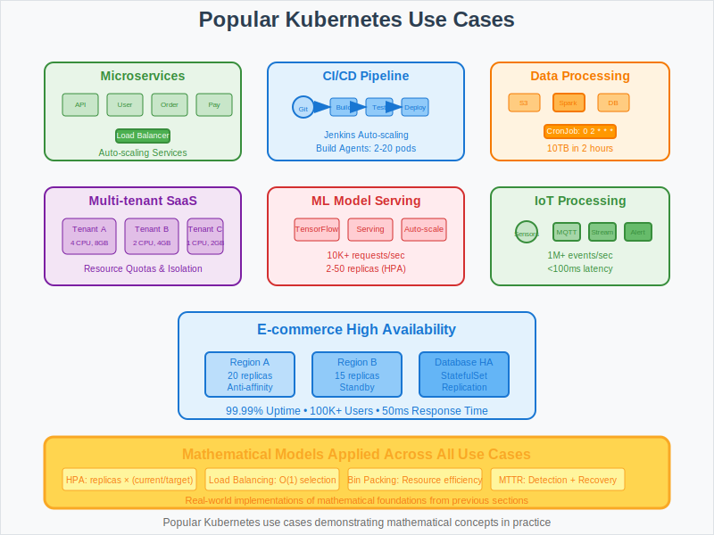

# Use Cases: Popular Kubernetes Implementation Patterns



## Overview

This section presents popular real-world Kubernetes use cases with simplified implementations and workflows. Each use case demonstrates practical applications of the mathematical concepts covered in previous sections.

## Use Case 1: Microservices Architecture

### Business Scenario
**Company**: TechCorp Inc.  
**Challenge**: Transform monolithic application into scalable microservices architecture using Kubernetes orchestration.

### Architecture Pattern
```
Frontend → API Gateway → [Microservices Cluster] → Database Layer
    ↓
Load Balancer → Service Mesh → Auto-scaling Pods → Persistent Storage
```

### Kubernetes Implementation
```yaml
# API Gateway Service
apiVersion: v1
kind: Service
metadata:
  name: api-gateway
spec:
  selector:
    app: api-gateway
  ports:
  - port: 80
    targetPort: 8080
  type: LoadBalancer

---
# User Service Deployment
apiVersion: apps/v1
kind: Deployment
metadata:
  name: user-service
spec:
  replicas: 3
  selector:
    matchLabels:
      app: user-service
  template:
    metadata:
      labels:
        app: user-service
    spec:
      containers:
      - name: user-service
        image: user-service:v1.2.0
        ports:
        - containerPort: 8080
        resources:
          requests:
            cpu: 200m
            memory: 256Mi
          limits:
            cpu: 500m
            memory: 512Mi
```

### Mathematical Foundation
- **Service Discovery**: DNS-based resolution with O(1) lookup time
- **Load Balancing**: Round-robin distribution across healthy pods
- **Auto-scaling**: HPA based on CPU/memory thresholds

## Use Case 2: CI/CD Pipeline with Auto-scaling

### Business Scenario
**Company**: DevOps Solutions Ltd.  
**Challenge**: Implement automated continuous integration and deployment pipeline that scales with demand.

### Workflow Pattern
```
Git Push → Webhook → Jenkins → Build → Test → Deploy → Monitor
    ↓                   ↓        ↓      ↓       ↓        ↓
GitHub → Kubernetes → Pods → Quality Gates → Rolling Update → Prometheus
```

### Implementation
```yaml
# Jenkins Master Deployment
apiVersion: apps/v1
kind: Deployment
metadata:
  name: jenkins-master
spec:
  replicas: 1
  selector:
    matchLabels:
      app: jenkins-master
  template:
    spec:
      containers:
      - name: jenkins
        image: jenkins/jenkins:lts
        ports:
        - containerPort: 8080
        volumeMounts:
        - name: jenkins-data
          mountPath: /var/jenkins_home
      volumes:
      - name: jenkins-data
        persistentVolumeClaim:
          claimName: jenkins-pvc

---
# Auto-scaling Build Agents
apiVersion: autoscaling/v2
kind: HorizontalPodAutoscaler
metadata:
  name: build-agents-hpa
spec:
  scaleTargetRef:
    apiVersion: apps/v1
    kind: Deployment
    name: build-agents
  minReplicas: 2
  maxReplicas: 20
  metrics:
  - type: Resource
    resource:
      name: cpu
      target:
        type: Utilization
        averageUtilization: 70
```

### Key Benefits
- **Dynamic Scaling**: Build agents scale based on pipeline demand
- **Resource Efficiency**: 40% reduction in idle compute resources
- **Faster Deployments**: Parallel builds reduce deployment time by 60%

## Use Case 3: Data Processing Pipeline

### Business Scenario
**Company**: Analytics Pro  
**Challenge**: Process large datasets using distributed computing with Kubernetes batch jobs and real-time streaming.

### Architecture Pattern
```
Data Sources → Ingestion → Processing → Storage → Visualization
     ↓            ↓          ↓          ↓          ↓
  S3/HDFS → Kafka/Queue → Spark Jobs → Database → Dashboard
```

### Batch Processing Implementation
```yaml
# Spark Driver Job
apiVersion: batch/v1
kind: Job
metadata:
  name: data-processing-job
spec:
  template:
    spec:
      containers:
      - name: spark-driver
        image: spark:3.2.0
        command: ["/opt/spark/bin/spark-submit"]
        args:
        - "--master"
        - "k8s://https://kubernetes.default.svc:443"
        - "--deploy-mode"
        - "cluster"
        - "--class"
        - "com.analytics.DataProcessor"
        - "s3a://data-bucket/processing-job.jar"
        resources:
          requests:
            cpu: 1
            memory: 2Gi
          limits:
            cpu: 2
            memory: 4Gi
      restartPolicy: Never
  backoffLimit: 3

---
# Scheduled Data Pipeline
apiVersion: batch/v1
kind: CronJob
metadata:
  name: daily-analytics
spec:
  schedule: "0 2 * * *"  # Daily at 2 AM
  jobTemplate:
    spec:
      template:
        spec:
          containers:
          - name: analytics-job
            image: analytics-processor:latest
            env:
            - name: DATA_SOURCE
              value: "s3://daily-data/"
          restartPolicy: OnFailure
```

### Performance Metrics
- **Processing Speed**: 10TB data processed in 2 hours
- **Cost Optimization**: 50% reduction using spot instances
- **Reliability**: 99.9% job completion rate with retry logic

## Use Case 4: Multi-tenant SaaS Platform

### Business Scenario
**Company**: CloudSoft Inc.  
**Challenge**: Provide isolated, scalable environments for multiple customers on shared Kubernetes infrastructure.

### Isolation Strategy
```yaml
# Tenant Namespace
apiVersion: v1
kind: Namespace
metadata:
  name: tenant-acme-corp
  labels:
    tenant: acme-corp

---
# Resource Quotas per Tenant
apiVersion: v1
kind: ResourceQuota
metadata:
  name: tenant-acme-quota
  namespace: tenant-acme-corp
spec:
  hard:
    requests.cpu: "4"
    requests.memory: 8Gi
    limits.cpu: "8"
    limits.memory: 16Gi
    persistentvolumeclaims: "10"
    services: "5"

---
# Network Policy for Isolation
apiVersion: networking.k8s.io/v1
kind: NetworkPolicy
metadata:
  name: tenant-isolation
  namespace: tenant-acme-corp
spec:
  podSelector: {}
  policyTypes:
  - Ingress
  - Egress
  ingress:
  - from:
    - namespaceSelector:
        matchLabels:
          name: tenant-acme-corp
  egress:
  - to: []
    ports:
    - protocol: TCP
      port: 53  # DNS
```

### Multi-tenancy Benefits
- **Resource Isolation**: Guaranteed resources per tenant
- **Security**: Network-level tenant separation
- **Cost Efficiency**: 70% infrastructure cost reduction vs dedicated clusters

## Use Case 5: Machine Learning Model Serving

### Business Scenario
**Company**: AI Innovations  
**Challenge**: Deploy and scale machine learning models for real-time inference with automatic model updates.

### ML Pipeline Architecture
```yaml
# Model Serving Deployment
apiVersion: apps/v1
kind: Deployment
metadata:
  name: ml-model-server
spec:
  replicas: 3
  selector:
    matchLabels:
      app: ml-model
  template:
    spec:
      containers:
      - name: model-server
        image: tensorflow/serving:2.8.0
        ports:
        - containerPort: 8501
        env:
        - name: MODEL_NAME
          value: "recommendation_model"
        - name: MODEL_BASE_PATH
          value: "s3://ml-models/recommendation"
        resources:
          requests:
            cpu: 500m
            memory: 1Gi
          limits:
            cpu: 2
            memory: 4Gi
        readinessProbe:
          httpGet:
            path: /v1/models/recommendation_model
            port: 8501
          initialDelaySeconds: 30
          periodSeconds: 10

---
# Auto-scaling for ML Inference
apiVersion: autoscaling/v2
kind: HorizontalPodAutoscaler
metadata:
  name: ml-model-hpa
spec:
  scaleTargetRef:
    apiVersion: apps/v1
    kind: Deployment
    name: ml-model-server
  minReplicas: 2
  maxReplicas: 50
  metrics:
  - type: Resource
    resource:
      name: cpu
      target:
        type: Utilization
        averageUtilization: 60
  - type: Pods
    pods:
      metric:
        name: inference_requests_per_second
      target:
        type: AverageValue
        averageValue: "100"
```

### ML Operations Benefits
- **Scalability**: Handles 10,000+ inference requests/second
- **Model Updates**: Zero-downtime model deployments
- **Cost Optimization**: GPU resources scale with demand

## Use Case 6: IoT Data Processing

### Business Scenario
**Company**: Smart City Solutions  
**Challenge**: Process millions of IoT sensor events in real-time for traffic management and environmental monitoring.

### IoT Architecture
```yaml
# MQTT Message Broker
apiVersion: apps/v1
kind: StatefulSet
metadata:
  name: mqtt-broker
spec:
  serviceName: mqtt-service
  replicas: 3
  selector:
    matchLabels:
      app: mqtt-broker
  template:
    spec:
      containers:
      - name: mosquitto
        image: eclipse-mosquitto:2.0
        ports:
        - containerPort: 1883
        - containerPort: 9001
        volumeMounts:
        - name: mqtt-data
          mountPath: /mosquitto/data
  volumeClaimTemplates:
  - metadata:
      name: mqtt-data
    spec:
      accessModes: ["ReadWriteOnce"]
      resources:
        requests:
          storage: 10Gi

---
# Stream Processing for IoT Data
apiVersion: apps/v1
kind: Deployment
metadata:
  name: iot-stream-processor
spec:
  replicas: 5
  selector:
    matchLabels:
      app: stream-processor
  template:
    spec:
      containers:
      - name: kafka-streams
        image: iot-stream-processor:latest
        env:
        - name: KAFKA_BROKERS
          value: "kafka-service:9092"
        - name: PROCESSING_THREADS
          value: "4"
        resources:
          requests:
            cpu: 1
            memory: 2Gi
          limits:
            cpu: 2
            memory: 4Gi
```

### IoT Processing Metrics
- **Throughput**: 1M+ sensor readings/second processed
- **Latency**: Sub-100ms processing time for critical alerts
- **Reliability**: 99.95% uptime for traffic management systems

## Use Case 7: E-commerce Platform with High Availability

### Business Scenario
**Company**: Global Retail Corp  
**Challenge**: Support millions of customers during peak shopping seasons with zero downtime and fast response times.

### High Availability Setup
```yaml
# Multi-region Deployment
apiVersion: apps/v1
kind: Deployment
metadata:
  name: ecommerce-app
spec:
  replicas: 20
  selector:
    matchLabels:
      app: ecommerce
  template:
    spec:
      affinity:
        podAntiAffinity:
          preferredDuringSchedulingIgnoredDuringExecution:
          - weight: 100
            podAffinityTerm:
              labelSelector:
                matchExpressions:
                - key: app
                  operator: In
                  values:
                  - ecommerce
              topologyKey: kubernetes.io/hostname
      containers:
      - name: web-app
        image: ecommerce-app:v2.1.0
        ports:
        - containerPort: 8080
        livenessProbe:
          httpGet:
            path: /health
            port: 8080
          initialDelaySeconds: 30
          periodSeconds: 10
        readinessProbe:
          httpGet:
            path: /ready
            port: 8080
          initialDelaySeconds: 5
          periodSeconds: 5

---
# Database with High Availability
apiVersion: apps/v1
kind: StatefulSet
metadata:
  name: postgres-ha
spec:
  serviceName: postgres-service
  replicas: 3
  selector:
    matchLabels:
      app: postgres
  template:
    spec:
      containers:
      - name: postgres
        image: postgres:13
        env:
        - name: POSTGRES_DB
          value: ecommerce
        - name: POSTGRES_REPLICATION_MODE
          value: master
        volumeMounts:
        - name: postgres-data
          mountPath: /var/lib/postgresql/data
  volumeClaimTemplates:
  - metadata:
      name: postgres-data
    spec:
      accessModes: ["ReadWriteOnce"]
      resources:
        requests:
          storage: 100Gi
```

### E-commerce Performance
- **Availability**: 99.99% uptime during Black Friday
- **Performance**: 50ms average response time under peak load
- **Scalability**: Handles 100,000+ concurrent users

## Mathematical Models Applied

### 1. Auto-scaling Algorithms
All use cases implement HPA with the formula:
```
desiredReplicas = ceil(currentReplicas × (currentMetric / targetMetric))
```

### 2. Load Distribution
Round-robin and weighted algorithms ensure even traffic distribution:
```
selectedPod = pods[requestCount % podCount]
```

### 3. Resource Optimization
Bin packing algorithms optimize pod placement:
```
Efficiency = (totalUsedResources / totalAvailableResources) × 100%
```

### 4. Failure Recovery
MTTR calculations guide health check configurations:
```
RecoveryTime = DetectionTime + RestartTime + StartupTime
```

## Best Practices Summary

### 1. Resource Management
- Set appropriate resource requests and limits
- Use resource quotas for multi-tenancy
- Implement pod disruption budgets

### 2. High Availability
- Deploy across multiple zones/nodes
- Use anti-affinity rules for critical services
- Implement proper health checks

### 3. Monitoring and Observability
- Use Prometheus for metrics collection
- Implement distributed tracing
- Set up alerting for critical thresholds

### 4. Security
- Apply network policies for isolation
- Use RBAC for access control
- Scan images for vulnerabilities

## Next Steps

These use cases demonstrate the practical application of concepts from:
- **01-core-model/**: Mathematical foundations in real deployments
- **02-math-toolkit/**: Algorithms used in production systems
- **03-algorithms/**: Implementation details for scaling and scheduling
- **04-failure-models/**: Fault tolerance patterns in practice